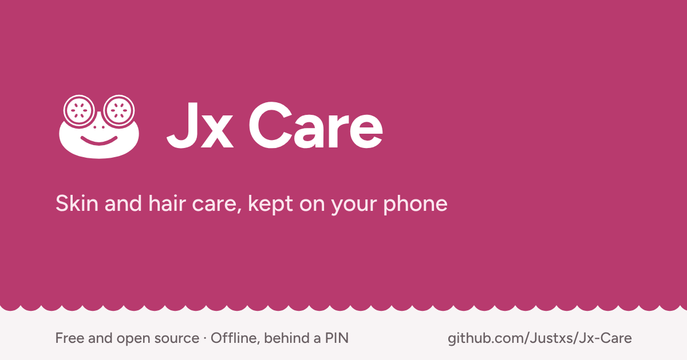

# Jx Care

Jx Care helps one person look after their skin and hair: which products they own and when each expires, what to put on in the morning and evening, when to wash or treat their hair, and how their skin changes week to week. It answers "what do I need to do today?" in one glance. Everything stays on the phone, behind a PIN, in Lithuanian or English. There is no account, no server and nothing to sync.

React Native app for iOS and Android phones, built with Expo and SQLite. Free and open source under the [MIT licence](LICENSE). It is not in the App Store or Google Play yet; build it yourself with the steps below.

## What it does

- **Products:** your shelf with brand, photo, size, price and ingredients, for skin, hair or both. Expiry is worked out from the printed date, the day you opened it and how long it lasts after opening, with a reminder before it runs out. Finished products move to an archive with their cost per day.
- **Routines:** morning, evening or your own, with steps linked to products. Steps can run every time, on set days or every few days, and two routines can share a time of day as A and B. Tick steps as you go in the routine player, with wait timers and local reminders.
- **Hair:** wash days that count from the last wash, plus trims, colour and treatments on their own rhythm.
- **Today, calendar and streaks:** one screen for what is due today, a calendar of what was done, and separate skin and hair streaks.
- **Ingredients:** conflicts are checked across the whole day, with ingredient groups and an avoid list. The default conflict rules come only from drug labels, FDA monographs and published studies; see [docs/ingredient-conflicts.md](docs/ingredient-conflicts.md) for each source.
- **Progress:** a guided weekly photo with the last one as a guide, two weeks side by side, a daily check-in on how your skin and hair feel, and dated notes and ratings on each product.
- **Shopping list:** finished and expiring products are offered for the list; a bought item becomes a new product in one tap.
- **Private by design:** a PIN with Face ID or fingerprint and a recovery question, content blurred in the app switcher, photos kept in the app's own storage, and a backup to one file you can restore on a new phone.

Every screen is described in [docs/feature-spec.md](docs/feature-spec.md).

## Run it

```sh
npm install -g pnpm   # once per computer; the repo pins pnpm 12.9.1 in package.json
pnpm install
pnpm expo start
```

The app uses native modules that are not in Expo Go, so open it in a development build (`pnpm expo run:android` or `pnpm expo run:ios`, or the EAS `development` build below).

Corepack can't run pnpm 12, which is why it is installed with npm. The app keeps a flat `node_modules` (set in [pnpm-workspace.yaml](pnpm-workspace.yaml)) for Metro, Jest and Expo autolinking.

## Check it

```sh
pnpm check   # typecheck, lint, format check and tests
```

`pnpm check` runs `pnpm typecheck` (TypeScript), `pnpm lint` (oxlint), `pnpm format:check` (oxfmt) and `pnpm test` (Jest). `pnpm format` fixes formatting. Run it before every commit.

Other scripts: `pnpm db:generate` writes a Drizzle migration after a schema change, and `pnpm run licences` refreshes the licence list shown in Settings after adding or updating packages.

## Storybook

Every component and screen has stories that run on the phone:

```sh
pnpm storybook
```

Then open `jxcare://storybook` in a development build. [docs/storybook.md](docs/storybook.md) has the details and how to write a story.

## Build it

Builds run on EAS ([eas.json](eas.json)); sign in once with `pnpm dlx eas-cli login`.

```sh
pnpm dlx eas-cli build --profile development --platform android   # dev client for pnpm expo start
pnpm dlx eas-cli build --profile preview --platform android       # installable APK
pnpm dlx eas-cli build --profile preview --platform ios           # ad-hoc IPA (needs an Apple account)
```

The version lives in `app.json` (`pnpm version:bump`); build numbers are set by EAS (`appVersionSource: remote`). Before shipping a new version to phones that already have the app, follow [docs/releasing.md](docs/releasing.md): it covers the signing key to keep, database changes and the update test.

Without EAS, `pnpm apk` builds a test APK on this computer (needs Android Studio; it writes `dist/jx-care-<version>.apk`). It is signed with the debug key, so it and an EAS build can't update each other: move between them with Settings → Backup.

The first build asks to create the EAS project and link it (it writes the project id into `app.json`); say yes and commit that change. After installing a build, walk [docs/device-checklist.md](docs/device-checklist.md).

## Website

The landing page lives in [landing/](landing/README.md), a separate Vite + React package with its own lockfile (`cd landing && pnpm install && pnpm dev`).

## Stack

| Area | What |
| --- | --- |
| App | Expo SDK 57, React Native 0.86 (New Architecture), Expo Router |
| Data | SQLite (expo-sqlite) with Drizzle ORM; PIN and secrets in expo-secure-store |
| State and forms | TanStack Query, TanStack Store, TanStack Form, zod |
| UI | rn-primitives components styled with NativeWind 4.2, Reanimated 4, lucide icons, Figtree |
| Languages | i18next with Lithuanian and English in [locales/](locales/) |
| Quality | TypeScript, oxlint, oxfmt, Jest with Testing Library, on-device Storybook 10 |

## Where things are

| Path | What |
| --- | --- |
| `app/` | Screens and routes (Expo Router) |
| `src/features/` | One folder per feature: products, routines, today, hair, calendar, conflicts, progress, condition, shopping, security, settings, backup, onboarding |
| `src/components/`, `src/theme/` | Shared components and design tokens |
| `src/db/` | Database schema and migrations |
| [docs/feature-spec.md](docs/feature-spec.md) | What to build: every screen, flow and rule |
| [DESIGN.md](DESIGN.md), [docs/design/](docs/design/) | How it looks: tokens, components and screens |
| [PRODUCT.md](PRODUCT.md) | Purpose, who uses it and its constraints |
| [docs/brand.md](docs/brand.md), [assets/brand/](assets/brand/) | The frog logo, colours and app icons |
| [docs/tasks/](docs/tasks/README.md) | The build plan, split into tasks, and the coding [conventions](docs/tasks/conventions.md) |

Coding agents start from [CLAUDE.md](CLAUDE.md).

## Support

Jx Care is built and kept up by one developer. If it helps you, you can [support it on Ko-fi](https://ko-fi.com/justxs). Ideas and bug reports are welcome as [GitHub issues](https://github.com/Justxs/Jx-Care/issues).

## Licence

[MIT](LICENSE) © 2026 Justas Pranauskis
