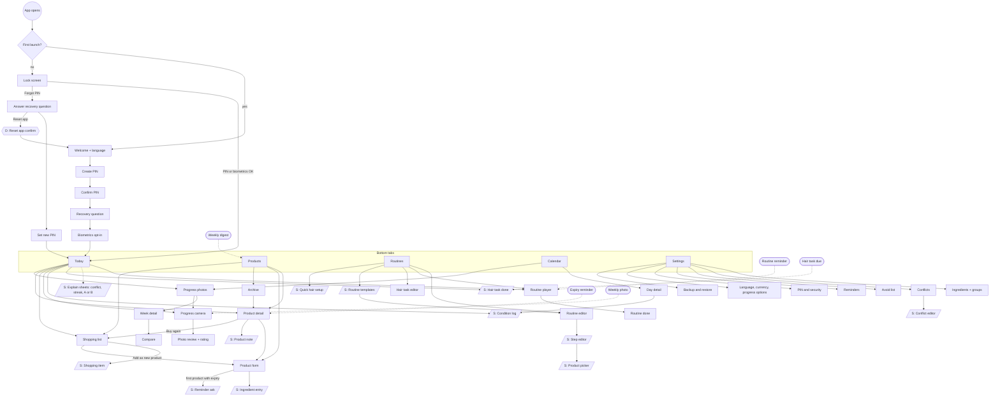
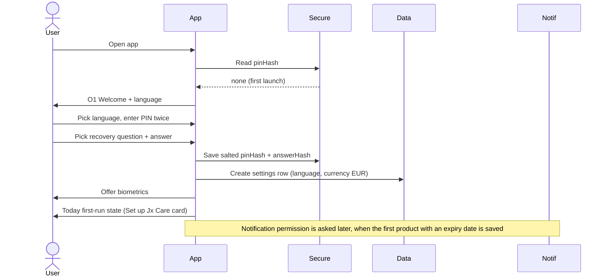
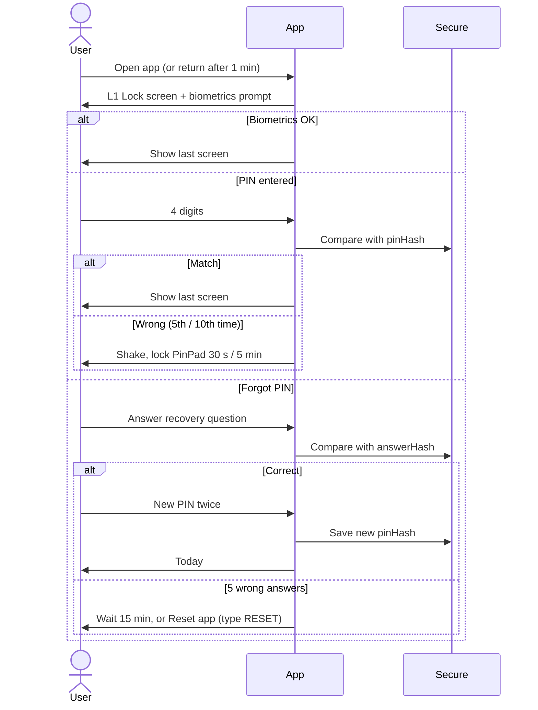
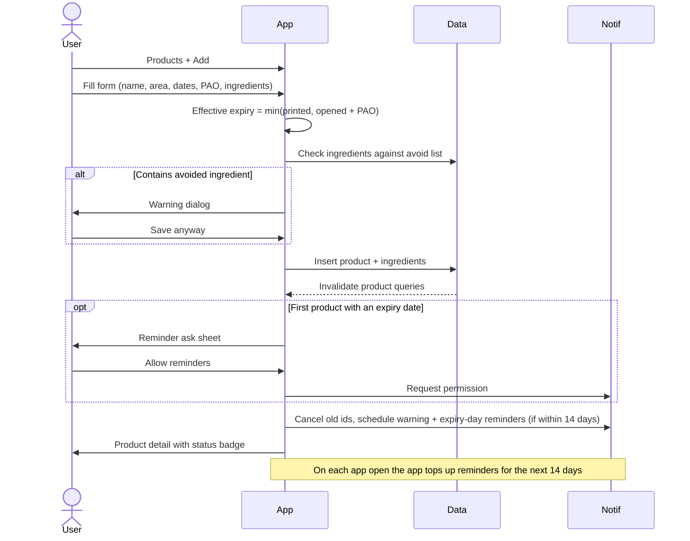
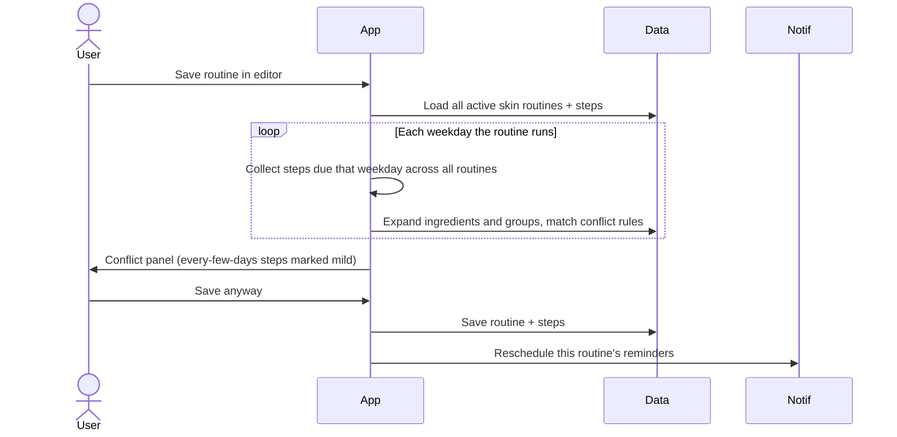
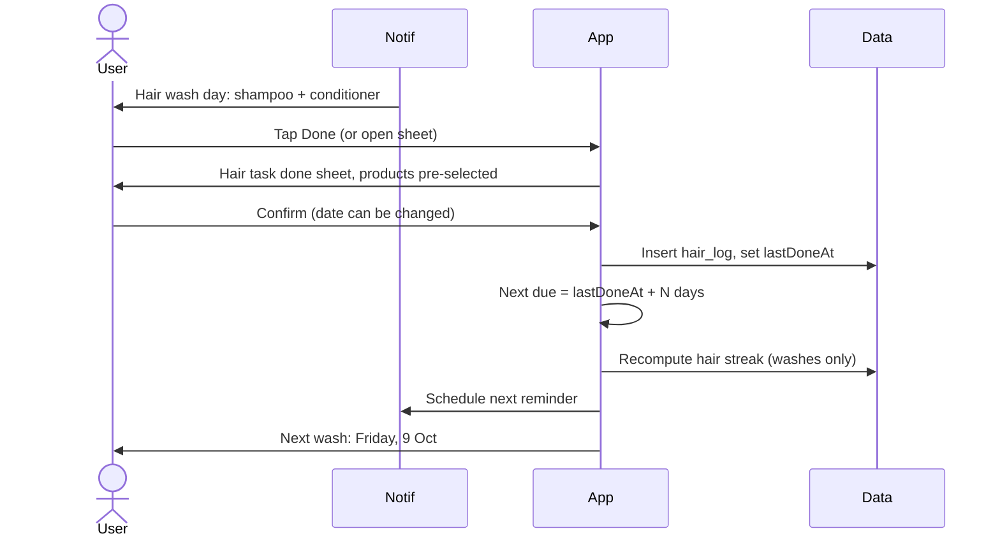
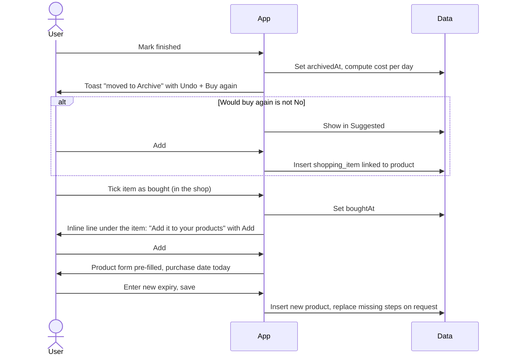
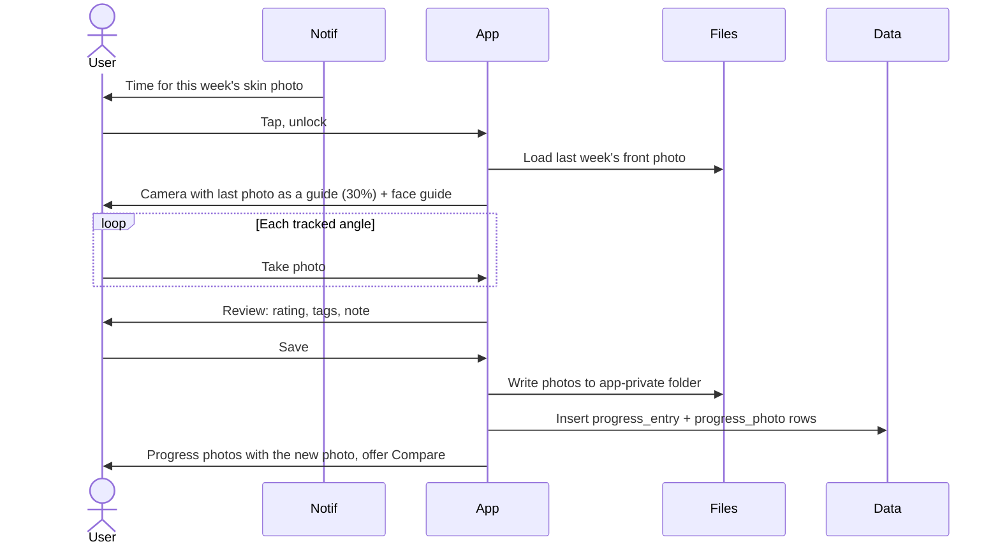
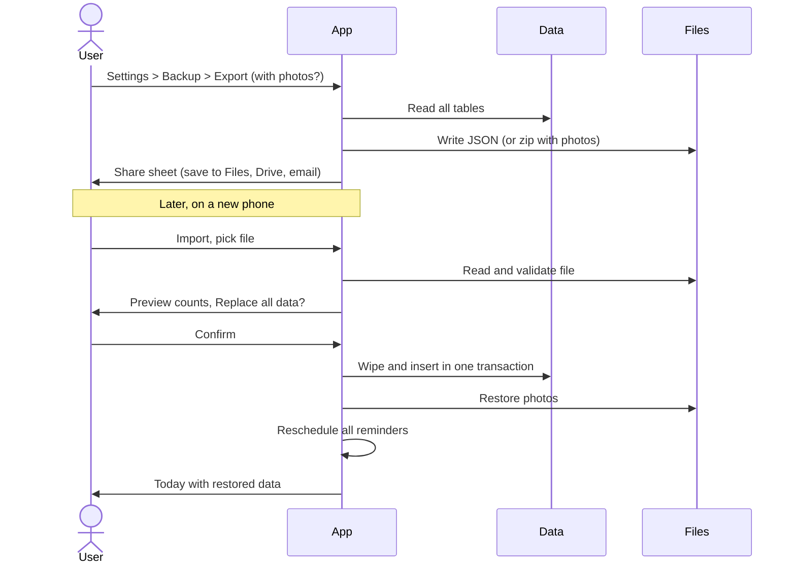

# Jx Care Feature Spec

Written 2026-10-06, kept in line with design system v18 (2026-10-07). This file is the current version; the [Claude Doc](https://claude.ai/code/artifact/f898c0ac-edef-4786-bbd1-bebf1fa6c8fd) is an earlier copy.

## Overview

This spec describes every screen, state and flow in Jx Care in enough detail to design from. It builds on the [feature plan](https://github.com/Justxs/Jx-Care/blob/main/docs/feature-plan.md); where the two differ, this spec wins. Visual style, tokens and components come from the [Jx Care design system](https://claude.ai/artifact/6wezpPoHNSQoe9bM6GUryU).

### Refinements made in this review

| # | Area | Gap found | Refinement |
| --- | --- | --- | --- |
| 1 | Day boundary | An evening routine done at 00:30 would count for the wrong day | The app's day ends at 04:00, not midnight, for routines, streaks and logs |
| 2 | Streak + step schedules | "Every step done" was unclear once steps have their own schedule | Only steps due that day count toward done |
| 3 | Two routines at one time of day | Unclear what Today shows | Today shows one card per time of day with A/B chips; finishing either completes it. The two are alternatives, so they are never checked against each other for conflicts |
| 4 | Expiry without dates | No rule for unopened products with no printed date | Status "No date" (grey); no reminders |
| 5 | Conflicts + step schedules | Whole-day checks could flag steps that never meet | Only steps due on the same weekday are compared, and A/B alternates at one time of day are never compared with each other; every-few-days steps show "mild" |
| 6 | Hair schedule | No rule for washing early | Early counts as on time and resets the next due date; late shows orange |
| 7 | PIN lockout | Only one lockout step | 5 wrong tries: 30 s wait; 10: 5 min. Recovery answer: 5 wrong tries, 15 min |
| 8 | Notification permission | Never asked | Asked in context: when the first product with an expiry date is saved, and when the first routine reminder is switched on, with "Not now" |
| 9 | Currency | Price had no currency | Currency set in Settings, default EUR |
| 10 | Archive vs delete | Two ways to remove a product | "Mark finished" moves it to the Archive (keeps history); "Delete" only from the archive, with confirmation |
| 11 | Missing product in a routine | A finished product left a broken step | The step shows "Finished" with "Pick another" and "Buy again" actions |
| 12 | Actions out of thumb reach (2026-10-07 critique) | + and Save sat top right | List screens add with a labelled Fab at the bottom right; form screens save from a bar pinned to the bottom; the header keeps back/close, the title and at most one word action (Select, Share, Compare) |
| 13 | Routine done in one tap (2026-10-07 critique) | Four checkboxes with wet hands | Today's routine card has All done next to Start; the player has All done under the list and a designed finished screen |
| 14 | Adding many products (2026-10-07 critique) | From the second product on, Add opened the 13-field form | Every new product uses the short form, with Save and add another; the full form is for editing |

### Global UI rules

- **Platforms:** iOS and Android phones, portrait only. Designs at 390 × 844 (iPhone) with checks at 360 × 800 (small Android).
- **Theme:** light and dark, following the phone; Figtree; pink accent; rn-primitives for every base component.
- **Language:** every string comes from LT and EN translation files. Lithuanian runs about 20–30% longer, so labels wrap to two lines instead of truncating.
- **Dates and numbers:** LT uses 2026-10-06, 24-hour time and "12,50 €". EN shows dates as "15 Oct", adding the year only when it is not this year ("1 Mar 2027"); a date field whose value is today reads "Today, 6 Oct". Dates use Intl.DateTimeFormat with the app language; numbers and currency follow the phone's locale.
- **Touch:** targets at least 44 × 44 pt; ticking a step gives a light haptic. Primary actions sit at the bottom: a labelled Fab adds on list screens, and form screens have Save in a bar pinned to the bottom (sheets in their footer). Lists keep 96 pt of space at the end so the last row scrolls clear of the Fab.
- **Choices:** two short options use a segmented control; three or more, or labels that run long in Lithuanian, use a radio list (one row per option, round marks); long value lists use a select. Checkboxes are square so they never look like radio buttons.
- **Explaining:** anything the user might not understand opens a short sheet when tapped: the Conflict and Mild conflict tags, the streak chips, and "About A and B" on Today (copy in the design system's ExplainSheets).
- **States:** every list screen has an empty state (illustration, one line, one action), and every form has inline validation under the field.
- **Destructive actions:** confirm in an AlertDialog (delete, reset app). Their text says what is lost and whether it can be undone. Reversible ones (Mark finished, Clear bought, removing an avoid-list entry) show a toast that names the thing, with Undo ("Vitamin C serum moved to Archive"). Toasts stay 8 seconds; while a screen reader is on they stay until the next action or until dismissed.
- **Privacy:** photos are never written to the phone gallery; the app content is hidden in the app switcher (blur overlay) while locked.

### Words and copy

One word per idea, used the same way on every screen and in notifications:

| Idea | Say |
| --- | --- |
| Put a product on the shopping list | Buy again |
| Product used up | Mark finished (action), Finished (state), Archive (place); toast "Vitamin C serum moved to Archive" |
| Start a routine | Start |
| Morning / Evening / Custom | Time of day |
| Schedule options for steps and hair tasks | Every time, Set days, Every few days (field "Repeat every (days)") |
| Trims, colour, scrubs | Other care (hair group and task type) |
| Soft conflict (an every-few-days step that only meets the other on some days) | Mild conflict; "mild" in the editor panel |
| Skin tags (condition log, photo review, product notes) | Calm, Glow, Oily, Dry, Breakout, Redness, Itchy |
| Weekly progress photo | Weekly photo |
| Faded last photo in the camera | Last photo as a guide (setting), "Show last photo as a guide" (camera button) |
| Settings group that holds Reminders | Notifications |
| Tick every step at once | All done |
| A past day with routines set and none finished | Not done (never "Missed") |
| A progress photo | Its date ("6 Oct"), never a week number |
| Today's photo and condition card | Check-in |

- **Errors** say what happened and what to do, and never guess a cause. A field error replaces the hint under the field in place ("Enter a name.").
- **Warnings** that don't block say so ("You can still save."); warnings that lead to a confirm say that.
- **Destructive actions** say what is lost and whether it can be undone.
- **Success toasts** name the thing and offer Undo ("Parfum removed · Undo"). A next step that needs a decision goes inline on the row, so it never times out (Shopping: "Add it to your products to track when it expires." with Add).
- **Streaks** use a calendar-check icon, never a flame. After a break: "Started again. Your best is still 21 days."
- **Spoken labels:** "Delete last digit" on the PIN pad, "More actions" on overflow menus. Icon-only buttons are kept for back, close, more, search, filter and month arrows; other header actions are words.
- **Conflict tag:** the only conflict marker anywhere (Today, Routines, player, editor): an amber pill with a triangle and the word "Conflict" or "Mild conflict", tappable with a 44 pt hit area where it opens details. Never a colour-only dot; red is kept for expiry and the avoid list.
- **No faded text:** states like done, waiting, bought or expired change text colour (muted) or add a badge or strike-through; text is never dimmed with opacity, so it keeps 4.5:1 contrast.
- **Weekday dots** show scheduled days in soft pink (accent-soft with accent text), not solid pink, and their spoken label lists the days in words.
- **Progress bars** fill with a transform (scaleX from the left), not by animating width.

### Styling

- **NativeWind 4.2** (Tailwind CSS 3.4 classes on React Native components), the newest stable release. NativeWind 5 (Tailwind 4) is still a release candidate; move to it once it is stable.
- Design system tokens (colours, type scale, spacing, radius, shadow) live in `tailwind.config.js` as CSS variables, with a light and a dark set, so `bg-background`, `text-foreground` and `bg-accent` switch with the phone theme.
- rn-primitives components are styled with `className`, the same setup React Native Reusables uses. No inline style objects except for animated values.
- Spacing on a 4 pt scale (`p-1` = 4 pt); screen side padding 16 pt; cards use the `rounded-xl` token.

### Motion and layout stability

Every screen should feel smooth and never jump. Animations use react-native-reanimated 4 and Expo Router's native transitions.

| Movement | Animation | Duration |
| --- | --- | --- |
| Switching bottom tabs | Cross-fade, no slide | 150 ms |
| Opening a screen (push) | Native platform transition: slide from right on iOS, fade-through on Android | System default |
| Full-screen flows (routine player, camera, compare) | Slide up; close slides down | 300 ms |
| Sheets | Slide up with backdrop fade; drag down to dismiss | Spring, about 300 ms |
| Dialogs | Fade in and scale 0.96 to 1 | 200 ms |
| Segmented switches inside a tab | Indicator slides; content cross-fades | 200 ms |
| List item added or removed | Fade plus height expand or collapse, never a hard pop | 200 ms |
| Dragging a routine step | Lifts (scale 1.03, shadow), others slide aside | Live |
| Ticking a step | Checkbox fills, light haptic | 150 ms |
| Routine finished | Card collapses to a ticked row; streak number counts up | 250 ms |
| Wrong PIN | Dots shake | 300 ms |

Easing: ease-out when things enter, ease-in when they leave. When the phone's Reduce Motion setting is on, slides and scales become short fades (100 ms) and counters show the final number at once.

No layout shift rules:

- **Skeletons, not spinners:** while data loads, each list and card shows a skeleton with the exact final size (product row 72 pt, routine card, calendar grid). Content replaces the skeleton in place with a 150 ms fade.
- **Paint Today complete:** Today's data is prefetched while the lock screen is open, so its sections are known before the first frame and none pop in afterwards.
- **Reserved image boxes:** images sit in fixed-ratio boxes with a placeholder colour before they load: product thumbnail 48 × 48, product photo 1:1, progress photos 3:4.
- **Reserved helper line:** every form field keeps a one-line slot under it for helper or error text, so a validation message never pushes the fields below.
- **Stable numbers:** countdowns, day counts and prices use tabular figures, and badges have a minimum width so "9 days" to "10 days" doesn't shift the row.
- **Fixed calendar height:** the month grid always has 6 rows, so swiping between months never changes its height.
- **Overlays stay out of the flow:** toasts, the wait timer countdown and the "Undo" bar float above the tab bar instead of being inserted between items.
- **Sections that appear later** (for example a conflict panel after a save) animate their height open instead of appearing at full size.
- **Lithuanian text:** layouts use minimum heights, not fixed ones, so longer LT labels wrap without overlapping; tab bar labels are sized for the LT words.
- **Keyboard:** forms scroll the focused field into view smoothly; the screen never jumps when the keyboard opens.

### Empty states

Every list has a title, one line of body text and at most one action.

| Screen | Title | Body | Action |
| --- | --- | --- | --- |
| Products | No products yet | Add the one you use most. Jx Care tracks when it expires. | Add product |
| Shopping | Nothing to buy | Finished and expiring products show up here as suggestions. | Add item |
| Routines, skin | No routines yet | Start from a template and swap in your products. | New routine |
| Routines, hair | Hair care is not set up | Tell Jx Care how often you wash your hair. | Set up hair care |
| Calendar | Your month fills in as you go | Each day you tick a routine gets a dot here. | None |
| Progress | No photos yet | Take one a week in the same light to see your skin change. | Take first photo |
| Archive | Nothing finished yet | Products you mark finished move here with their cost per day. | None |
| Avoid list | Nothing to avoid yet | Add ingredients that irritate you. Products that contain them get a red Avoid badge. | Add ingredient |
| Conflicts | No conflict rules | Start with pairs that drug labels warn about, like tretinoin with benzoyl peroxide, or write your own. | Add common rules (secondary: Add a rule) |

The app starts with these default rules, added on first launch (in the language chosen in onboarding) and once for installs from before they existed. They are ordinary rules the person can edit or delete; "Add common rules" (here, when every rule was deleted) puts back any that are missing:

Every default rule is backed by a published source; pairings that are popular online but lack evidence (vitamin C with acids, copper peptides with vitamin C, retinol with AHAs, niacinamide with vitamin C) are not defaults, and people can add them as their own rules.

| Rule | Note | Source |
| --- | --- | --- |
| Prescription retinoids × salicylic acid | Drug labels warn they can irritate and dry the skin together | [Tretinoin gel label](https://www.accessdata.fda.gov/drugsatfda_docs/label/2013/202567Orig1s000lbl.pdf), [Differin gel label](https://www.accessdata.fda.gov/drugsatfda_docs/label/2007/020380s004lbl.pdf), [Differin lotion label](https://www.accessdata.fda.gov/drugsatfda_docs/nda/2010/022502s000Lbl.pdf) ("particular caution … sulfur, resorcinol, or salicylic acid") |
| Prescription retinoids × sulfur | Same | Same |
| Prescription retinoids × resorcinol | Same | Same |
| Tretinoin × benzoyl peroxide | Benzoyl peroxide breaks down tretinoin | Tretinoin gel label (caution with benzoyl peroxide); [Nighland et al., Cutis 2006](https://www.mdedge.com/dermatology/article/67367/acne/effect-simulated-solar-uv-irradiation-tretinoin-tretinoin-gel): tretinoin gel mixed with a benzoyl peroxide gel kept 7% of its tretinoin after 2 hours and 0% after 6 |
| Benzoyl peroxide × salicylic acid | Drug labels warn they can irritate and dry the skin together | [21 CFR 333.350](https://www.law.cornell.edu/cfr/text/21/333.350), the required OTC acne label: "skin irritation and dryness is more likely to occur if you use another topical acne medication at the same time" |
| Benzoyl peroxide × sulfur | Same | Same |
| Benzoyl peroxide × resorcinol | Same | Same |
| Hydroquinone × benzoyl peroxide | Together they can stain the skin for a while | [Hydroquinone topical drug information](https://www.drugs.com/mtm/hydroquinone-topical.html): "together with benzoyl peroxide, hydrogen peroxide, or other peroxide products may stain your skin" |
| Hydroquinone × hydrogen peroxide | Same | Same |

The one group is Prescription retinoids (tretinoin, adapalene): only the retinoids whose labels carry that caution. Adapalene × benzoyl peroxide is not a conflict, since adapalene stays stable with it and the two are sold together as an approved combination. Group names and notes are translated when they are added; ingredient names are INCI names in both languages. The evidence for each rule, and why other popular pairs are left out, is in [ingredient-conflicts.md](ingredient-conflicts.md); the sources are also listed next to the rules in `src/features/conflicts/commonRules.ts`.

## Navigation map

Every screen sits behind the lock screen in five bottom tabs; sheets (S) slide up over the current screen and dialogs (D) are centred. Dotted lines are notification taps.

### Screen inventory

| ID | Screen | Type | Reached from |
| --- | --- | --- | --- |
| O1–O5 | Onboarding: welcome + language, create PIN, confirm PIN, recovery question, biometrics | Full screen | First launch, reset |
| L1 | Lock screen | Full screen | Every open, after 1 min away |
| L2 | Forgot PIN: recovery answer, new PIN | Full screen | Lock screen |
| T1 | Today | Tab | Home |
| T2 | Routine player, then Routine done | Full screen | Today, Routines, routine reminder |
| T3 | Hair task done | Sheet | Today, hair reminder |
| T4 | Condition log | Sheet | Today, Day detail |
| P1 | Products list (My products / Shopping switch) | Tab | Tab bar |
| P2 | Product detail | Screen | List, Today, expiry reminder |
| P3 | Add product (short form) / Edit product (all fields) | Screen | Fab, detail, shopping list |
| P4 | Ingredient entry (one per line) | Sheet | Product form |
| P5 | Archive | Screen | Products list |
| P6 | Shopping list | Tab view | Products switch, Today chip |
| P7 | Shopping item | Sheet | Shopping list |
| P8 | Product note | Sheet | Product detail |
| R1 | Routines list (Skin / Hair switch) | Tab | Tab bar |
| R2 | Routine editor | Screen | Routines list |
| R3 | Step editor | Sheet | Routine editor |
| R4 | Product picker | Sheet | Step editor, hair task editor |
| R5 | Hair task editor | Screen | Routines list (Hair) |
| C1 | Calendar (Skin / Hair / Condition views) | Tab | Tab bar |
| C2 | Day detail | Screen | Calendar |
| C3 | Progress photos (Skin / Hair) | Screen | Calendar row, Today check-in, weekly reminder |
| C4 | Progress camera | Full screen | Progress photos, Today's check-in, weekly reminder |
| C5 | Photo review + rating | Screen | Camera |
| C6 | Week detail | Screen | Progress photos |
| C7 | Compare | Full screen | Week detail, Progress photos |
| S1 | Settings | Tab | Tab bar |
| S2 | Ingredients + groups | Screen | Settings |
| S3 | Conflicts + editor | Screen + sheet | Settings |
| S4 | Avoid list | Screen | Settings |
| S5 | Reminders | Screen | Settings |
| S6 | PIN and security | Screen | Settings |
| S7 | Language, currency, progress options | Screen | Settings |
| S8 | Backup and restore | Screen | Settings |

## Onboarding, lock and Today

### O1–O5 Onboarding

Five short steps with a step bar ("1 of 5" to "5 of 5") at the top and Back on every step after the first. Nothing is saved until O4 finishes, so quitting mid-way restarts onboarding.

1. **O1 Welcome + language:** logo, app name, one-line pitch ("Track your skin and hair care in one place"), two large choices as a radio list: Lietuvių (Lithuanian) / English (Anglų), pre-selected from the phone language. Privacy line under the choices: "Everything stays on this phone. No account needed." (LT: "Viskas lieka šiame telefone. Paskyros nereikia."). Button: Continue.
2. **O2 Create PIN:** title "Create a 4-digit PIN", four dots, PinPad (0–9, "Delete last digit"). Moves on automatically after the 4th digit. Rejects 0000, 1234 and four identical digits with an inline hint.
3. **O3 Confirm PIN:** same layout, "Enter it again". Mismatch: dots shake, error "PINs don't match", back to O2.
4. **O4 Recovery question:** picker with 5 preset questions (first pet, mother's maiden name, first school, favourite teacher, birth city) plus "Write my own"; answer field (min 3 characters), hidden as typed with an eye button to show it; helper text "Hidden as you type. Tap the eye to check it."
5. **O5 Biometrics:** shown only if the phone supports it. Icon, "Unlock with Face ID / fingerprint?", buttons: Turn on / Not now. Either button lands on Today in its first-run state.

There is no reminders step. Notification permission is asked in context instead (see the reminder ask in P3).

### L1 Lock screen

- Logo, "Enter PIN", four dots, PinPad, biometrics button (if on), "Forgot PIN?" link.
- Biometrics prompt opens automatically once on arrival.
- Wrong PIN: dots shake + haptic. After 5 wrong in a row: PinPad disabled with a countdown "Try again in 30 s"; after 10: 5 minutes.
- Re-lock: after 60 s in the background (configurable 0 / 1 / 5 min). The app switcher shows a blurred overlay with the logo.

### L2 Forgot PIN

- Shows the saved question and an answer field (hidden as typed, with the eye button); answer is compared ignoring case, accents and extra spaces.
- Correct: Create new PIN (O2/O3 layout), then Today.
- 5 wrong answers: wait 15 minutes. Link at the bottom: "Reset app and delete all data" opens a dialog that requires typing RESET. The dialog names what is lost with real counts and never suggests exporting (the person is locked out): "This deletes 84 products, 6 routines and 52 progress photos. Progress photos are not in your gallery, so they are lost too. Your last backup is from 1 Sep; you can restore it after the reset." The Settings path (S7, unlocked) shows the same text plus an Export backup button.

### T1 Today

The home screen answers "what do I need to do today?". Sections top to bottom, each hidden when empty:

1. **Header:** greeting by time of day, date ("Tuesday, 6 Oct"), skin and hair streak chips (calendar-check icon + number); tapping a chip opens the streak sheet.
2. **Routine cards:** one card per time of day due today (Morning, Evening, custom), in time order. Card shows the time of day, "Reminder at 07:30 · 4 steps" (or "No reminder · 2 steps"), progress ring (3/5), and a conflict tag if any (see Conflict tag below). If a product in the routine is expired, the card or its done row names it in red ("SPF 50 fluid expired 2 Oct"). Two routines at one time of day: A/B chips on the card with "Pick one for tonight; Jx Care remembers it for Tuesdays. About A and B" (the link opens the A or B sheet); the chosen one is remembered for that weekday. The chips show only until the first step is ticked. Buttons: Start (Continue after a tick) opens the routine player; All done ticks every due step at once and shows "Evening done" with Undo. Done: card collapses to a ticked row.
3. **Expiring soon** (only while any product is expired, it sits here, directly under the routine cards): up to 3 product rows and "See all", with a "Shopping list · 3 to buy" row at the foot of the card. An expired row's badge carries the date ("Expired 2 Oct"); the date is never written twice in a row.
4. **Hair due:** rows for hair tasks due today or overdue ("Wash: shampoo + conditioner", "Overdue 1 day" in orange). Tap: Hair task done sheet.
5. **Expiring soon** when nothing is expired, same content as 3.
6. **Check-in:** one card. On the weekly photo day until taken: "This week's skin photo" with Take photo (secondary) and a "Skip this week" text link under it. Then "How's your skin today?" with the seven skin chips in the standard order (tapping one saves at once) and "Hair and note", which opens the Condition log sheet.

First-run state: a "Set up Jx Care" card with progress "n of 3" and three fixed-height rows: Add your first product (opens P3 quick mode), Build a routine (opens routine templates), Set up hair care (opens quick hair setup). The next step to do is opened with a filled button ("Build a routine"); the others are rows. Done rows show a green check and what was made. Below the card, an Optional group: weekly progress photo, ingredients to avoid. No streak chips or routine cards show until a routine exists. When all three rows are done the card becomes "You're set" (logo, one line, See today, which removes the card at once) and is removed the next day; long press, Hide removes it at once.

### T2 Routine player

- Full screen, opened from Today, Routines or a reminder. Header: routine name, time of day, close (X), progress "Step 2 of 5".
- List of steps due today in order; skipped-today steps are hidden. Each row: product photo, name, brand, note ("2 drops"), checkbox; the whole row toggles it. "All done" under the list ticks every remaining step.
- Ticking a step with a wait timer starts a countdown in a fixed bar at the bottom of the player ("Wait 1:00 before the next step") with a Skip wait button (not a link); until it ends the next step's text turns muted and its caption reads "Next, after the wait" (text is never faded with opacity).
- Conflict on a step: a tappable conflict tag; an amber line under the list names the other routine and the risk ("Vitamin C serum conflicts with the glycolic acid toner in tonight's Evening B. Using both on one day can irritate. Why?"); Why? opens the conflict sheet.
- Expired or finished product: the step becomes a card ("Step 4 · SPF 50 fluid") with a red "Expired 2 Oct" or neutral "Finished" badge, the line "Pick another product for this step, or tick it to use this one today.", and Pick another / Buy again.
- All ticked: the Routine done screen: logo, "Evening done", "All 4 steps, finished at 21:52.", the streak card counting up, what is next ("Next: Morning · Tomorrow at 07:30") and anything that needs attention (an expired product), then Back to Today and Add a note (opens the Condition log sheet, T4, on Skin). No confetti.
- Leaving mid-way keeps ticks for the day.

### T3 Hair task done sheet

- Title = task name, date (today, editable to yesterday or earlier), product chips pre-selected from the task (tap to unselect, + to add), note field. Button: Mark as done.
- After saving: shows the next due date ("Next wash: Friday, 9 Oct").

### T4 Condition log sheet

- Date at top (today by default). A Skin / Hair switch, each side showing how many tags are picked; Skin chips (Calm, Glow, Oily, Dry, Breakout, Redness, Itchy) or Hair chips (Shiny, Frizzy, Oily roots, Dry ends, Flaky scalp), multi-select, each optional; note field (max 280 characters). Save.

## Products and shopping

### P1 Products list

- **Top:** title with the word action Select, segmented switch My products / Shopping (with count badge), search field, list / shelf view button, filter button. Add product is the Fab.
- **Shelf view:** two columns of product tiles (photo, or the category glyph on the area's soft colour), name, date and status badge, for finding a bottle by sight. The choice is remembered.
- **Select:** rows get checkboxes; a bar above the tab bar offers Mark finished and Buy again for all selected.
- **Filters (sheet):** Area (All, Skin, Hair), Category (multi-select), Status (OK, Expiring soon, Expired, Not opened, No date), Avoid badge only. Sort: Soonest expiry (default), Name, Recently added.
- **Row (ProductRow):** photo thumbnail (or category icon), name, brand, AreaTag (Skin/Hair/Both), the date line ("Expires 15 Oct"), and a status badge only when the status needs attention ("Expired 2 Oct", "Expiring soon", "Not opened", "No date"); an OK product has no badge, avoid badge if it contains an avoided ingredient.
- **Swipe or long-press actions:** Mark as opened (if not opened), Mark finished, Buy again, Duplicate.
- **Footer link:** Archive (N).
- **Empty state:** see the Empty states table in the Overview; Add product opens quick mode.

Status rules: effective expiry = earlier of printed expiry and opened date + period after opening. Expiring soon = within the warning window (default 30 days). Not opened with a printed date uses that date. No dates at all = "No date" (grey).

### P2 Product detail

- Large photo (tap to view full screen), name, brand, AreaTag, category.
- **Expiry block:** status badge, progress bar from opened date to effective expiry, dates listed: purchased, opened, printed expiry, period after opening ("12M").
- **Details:** size + unit, price with currency, ingredients as chips (conflicting ones marked, avoided ones marked red), notes.
- **Used in:** routines and hair tasks that use it, each tappable.
- **My rating:** 1–5 stars and "Would buy again" Yes/No toggle.
- **Notes timeline:** dated reaction notes, newest first, Add note.
- **Cost per day:** shown once finished ("€0.21 a day over 142 days").
- **Actions bar:** Edit, Mark finished, Buy again. The header's More menu (spoken label "More actions") holds Mark as opened, Duplicate, and Delete only when in the Archive. Mark finished shows the toast "Vitamin C serum moved to Archive" with Undo.

### P3 Product form (add / edit)

One scrolling form in groups; only Name and Area are required. The only save action is the button in the bar pinned to the bottom ("Save product" when adding, "Save changes" when editing); there is no Save in the header. A field error replaces the hint under the field in place ("Enter a name.").

**Add product** always uses the short form (title "Your first product" the first time), from the Fab, the Today setup card, the Products empty state and a bought shopping item. The full form below is Edit product. Fields: Name, Used on (Skin / Hair / Both), "Is it open?" (Yes, I use it / Not yet). Yes shows Opened on and Use within chips 3M, 6M, 12M, 24M; Not yet shows an optional printed expiry. A live "Expires on" line, "More details" expanding photo, brand, category, price and ingredients, and the bottom bar: Save product, and Save and add another (keeps the form open, cleared, for the next bottle). Opened from a bought shopping item, fields the short form doesn't show (size, unit) are saved with the product as filled in, and can be changed in Edit product.

| Field | Control | Rules |
| --- | --- | --- |
| Photo | Camera / gallery picker | Optional, cropped square |
| Name | Text | Required, max 80 |
| Brand | Text with suggestions from earlier brands | Optional |
| Area | Toggle: Skin / Hair / Both | Required |
| Category | Select (cleanser, toner, serum, moisturiser, SPF, mask, exfoliant, eye care, shampoo, conditioner, hair mask, hair oil, styling, other) | Default other |
| Size + unit | Number + select (ml, g, pcs) | Optional |
| Price | Number with currency suffix | Optional, ≥ 0 |
| Purchase date | Date picker | Default today |
| Printed expiry date | Date picker | Optional |
| Opened | Toggle; reveals Opened date | Date ≤ today |
| Period after opening | Chips 3M, 6M, 9M, 12M, 18M, 24M, 36M + custom | Optional |
| Ingredients | Multi-line field, one ingredient per line (P4) | Optional |
| Notes | Multi-line text | Max 500 |

Live preview at the bottom: "Expires on 6 Apr 2027 (in 182 days)". An avoided ingredient shows a warning under the ingredients field ("Parfum is on your avoid list. Saving asks you to confirm."); saving then asks to confirm (Save anyway / Edit ingredients).

**Reminder ask:** when the first product with an expiry date is saved, a sheet asks "Get a reminder before it expires?" with the product name, when it would fire (30 days before and on the day) and an example notification. Buttons: Allow reminders / Not now. Allow shows the system prompt and turns on expiry reminders only. Not now doesn't ask again; Settings, Notifications, Reminders can turn them on. Switching on the first routine reminder asks the same way.

### P4 Ingredient entry

Ingredients are entered one per line in a multi-line field, not separated by commas: each line is one ingredient and Enter starts the next. While typing a line, matching ingredients are suggested above the keyboard: first from the user's list, then from the built-in catalogue of about 400 common ingredients by INCI name. The catalogue also matches everyday names and some Lithuanian ones ("Vitamin C", "Shea butter", "Vanduo"); such a suggestion shows the name that matched in brackets ("Ascorbic acid (Vitamin C)") and tapping it fills the line with the INCI name. Catalogue ingredients only join the user's list once a product uses them. Pasting a list with one ingredient per line works the same way. Blank lines are ignored, extra spaces are trimmed and duplicates are merged. Below the field, a live preview shows the parsed ingredients as chips: chips in a conflict show a small link icon, avoided ones show red, and ones not yet in the user's list show a "New" tag. Done saves the list and adds new ingredients to the user's list. Product detail links here with "Edit list".

Pasted lists: when pasted text contains a line with two or more commas (a list copied from a pack or a shop), that line is split at the commas and the hint reads "Pasted list split at commas into 5 lines." with Undo. Typed text is never split. The chip preview and the button ("Save 5 ingredients") always match the parsed lines.

### P5 Archive

Finished products, newest first, with finished date and cost per day. Sort by date or cost per day. A row's More button opens an action sheet: Restore to Products, Buy again, Delete (the dialog says the product, its notes and dates are deleted for good). Restore shows "Clay mask restored to Products" with Undo.

### P6 Shopping list

- **Suggested** (top, collapsible): finished or expiring products not yet on the list, each with + and dismiss. Products marked "Would buy again: No" never appear.
- **To buy:** checkbox rows: name, brand, AreaTag, last price and size for linked items, note. Filter chips: All, Skin, Hair.
- **Want to try:** separate section for ideas, same rows; "Move to To buy".
- **Bought:** ticked items, each showing "Bought 4 Oct · leaves the list after 30 days"; Clear bought button.
- Header word Share (plain text list); Add item is the Fab.
- A bought item that is not yet a product shows an inline line under it, "Add it to your products to track when it expires.", with Add (no toast, so it never times out). Add opens Add product pre-filled (name, brand, category, area, size, unit, ingredients, purchase date today).

### P7 Shopping item sheet

Toggle Buy again (pick product) / New item. New item fields: name (required), brand, area, list (To buy / Want to try), note.

### P8 Product note sheet

Date (default today), text (required, max 280), quick tags (Calm, Glow, Oily, Dry, Breakout, Redness, Itchy). Save.

## Routines and hair tasks

### R1 Routines list

- Segmented switch: Skin / Hair.
- **Skin:** routines grouped by time of day (Morning, Evening, custom). Card: name, weekday dots (M T W T F S S, active ones filled), "Reminder at 07:30 · 4 steps" (or "No reminder · 2 steps"), conflict tag, active switch. Tap: editor. Start button: routine player. New routine is the Fab. Long-press: Duplicate as variant, Delete. No section heading repeats a card's name; two routines at one time of day sit under "Evening, A or B" with the line "On nights both are set, you pick one on Today. A and B are never checked against each other for conflicts."
- **Hair:** two groups, Washes and Other care. Row: name, frequency ("Every 3 days", "Every 8 weeks", "Mon, Thu"), next due date, last done as a date ("Last 18 Aug"). New hair task is the Fab.
- Empty states: see the Empty states table in the Overview.

### R2 Routine editor

**Starting a routine:** New routine first opens a templates sheet with a Morning / Evening toggle. Evening: Treatment (cleanser, serum, moisturiser), Basics (cleanser, moisturiser), Start empty. Morning: Basics (cleanser, moisturiser, SPF), Light (rinse, moisturiser, SPF), Start empty. Steps are filled from the user's products by category; gaps say "Pick a product later". Create routine opens this editor to set days, time and reminder.

| Field | Control | Rules |
| --- | --- | --- |
| Name | Text | Required, e.g. "Evening A: retinol" |
| Time of day | Chips: Morning / Evening / Custom (name + default time) | Required |
| Days | Seven weekday toggles + "Every day" shortcut | At least one day |
| Reminder | Switch + time picker | Optional |
| Steps | Reorderable list (drag handle) | At least one step to save |

- Step row (RoutineStep): order number, product photo + name, schedule chip if not every time ("Tue, Fri" / "Every 3 days"), wait chip ("1 min"), conflict tag. Tap: step editor. Swipe: delete.
- **Conflict panel** at the bottom, when any: "2 conflicts this week", each line "Retinol (step 3) × Glycolic acid in Evening B, Tue" with a "mild" label for every-few-days steps. Saving is still allowed, and the panel says so ("You can still save."). The panel ends with "What does mild mean?", which opens the Mild conflict sheet. Save routine sits in the bottom bar.
- Unsaved changes: leaving asks Discard / Keep editing.

### R3 Step editor sheet

- Product (opens product picker; only Skin or Both products), note ("2 drops"), schedule as a radio list with a line each: Every time (default, "Each time the routine runs") / Set days ("Only on the days you pick"; weekday toggles limited to the routine's days) / Every few days ("For example every 3 days"; "Repeat every (days)" number + start date), wait after step as a select: none, 30 s, 1, 2, 5, 10, 15, 20 min.

### R4 Product picker sheet

Search, then Recent (up to 5 products last used in any step), then every product by name as you type; no category chips. Expired products sit in a "Can't be picked" group with their Expired badge, marked disabled with the reason in their spoken label ("Expired products stay out of new steps. Buy it again from Products."). Add new product opens Add product and returns with it selected.

### R5 Hair task editor

**Quick hair setup** (the first time, from the Today setup card or the Hair empty state): wash frequency chips (every day, every 2 days, every 3 days, twice a week, once a week, other), last wash chips (today, yesterday, 2 days ago, pick a date), a live "Next wash" line and an optional trim reminder every 8 weeks (other care, not counted in the streak). Saving creates the wash task and the trim task; the full editor below is for later changes.

| Field | Control | Rules |
| --- | --- | --- |
| Type | Toggle: Wash / Other care | Required |
| Name | Text | e.g. "Wash", "Hair mask", "Trim" |
| Products | Product picker, multi (Hair or Both) | Wash only |
| Frequency | Every few days ("Repeat every (days)") / Set days / Every few weeks (other care) | Required |
| Last done | Date | Default today; sets the first due date |
| Reminder | Switch + time | Optional |

Preview line: "Next due: Friday, 9 Oct". Save task sits in the bottom bar. Washes count toward the hair streak; other care doesn't.

## Calendar, progress and condition

### C1 Calendar

- Segmented switch: Skin / Hair / Condition. Under the grid, a Progress photos row ("Last photo 29 Sep · next one Sunday") opens C3.
- **Skin view:** month grid, Monday first; each day a 12 pt mark that differs by shape: done (filled accent), partly done (half), not done (grey ring), nothing scheduled (none); today outlined; the selected day uses the soft accent background (never the solid "done" colour). Each day's spoken label includes its status ("5 October, partly done"). Above: streak card with current and best ("12 days in a row · Best 21 days").
- **Hair view:** wash days done (filled), due (outlined), overdue (orange), other care as small icons (scissors, palette). Hair streak card.
- **Condition view:** each day shows the logged skin state as a small coloured chip (calm green, oily yellow, dry blue, breakout red, redness pink); legend below.
- Swipe left/right between months; "Today" button returns.

### C2 Day detail

- Date title, skin routines (done / partly done / not done, with each step ticked or not), hair tasks done, condition log (or "Log how your skin was"), product notes written that day, the weekly photo thumbnail if it was taken that day ("Skin photo, taken 6 Oct."). A day with nothing done says so and what was due ("Nothing done · Next wash was due 6 Oct").
- Past days are editable up to 7 days back (tick a forgotten step); older days are read-only.

### C3 Progress photos

- A pushed screen (not a Calendar segment), reached from the Calendar row, Today's check-in and the weekly photo reminder. Header word Compare.
- Switch Skin / Hair (Hair only when the hair album is on).
- Grid of weekly photos, newest first: front photo thumbnail labelled with the date it was taken ("6 Oct"), never a week number, and no stars on the tiles (the rating shows on C6). Missing weeks shown as dashed tiles "No photo" with "Skipped".
- Top: Take this week's photo (if not taken).
- Empty state: see the Empty states table in the Overview.

### C4 Progress camera

- Full-screen front camera, always dark (camera-* colour tokens in both themes). Last photo as a guide: last week's photo at 30% opacity, toggled with the "Show last photo as a guide" button, face oval guide, angle label ("Front", then "Left side", "Right side" for tracked angles), flash off, tips row "Same light · no makeup · hair back".
- Shutter, retake, switch camera. After each angle: next angle; after the last: review.

### C5 Photo review + rating

Photos of all angles, rating 1–5, tags (Calm, Glow, Oily, Dry, Breakout, Redness, Itchy), note. Save. Saving shows "Saved privately in Jx Care".

### C6 Week detail

All angles full width (swipe), rating, tags, note, "What changed this week": routines done (5 of 7 evenings), products started or stopped, condition log summary. Actions: Compare with…, Retake, Delete photo / week.

### C7 Compare

Two modes: side by side (two columns, date labels on top) and slider (one image, drag a vertical handle). Before and After pickers showing dates with thumbnails; quick chip "4 weeks ago vs now". Angle switcher. Pinch to zoom both in sync.

## Settings

### S1 Settings list

Grouped rows with chevrons: **Care data** (Ingredients, Conflicts, Avoid list), **Notifications** (Reminders), **Security** (PIN and security), **Preferences** (Language, Currency, Progress photos), **Data** (Backup and restore, Reset app), **About** (version, licences).

### S2 Ingredients + groups

- Tabs: Ingredients / Groups. Ingredient row: name, group chip, "in 4 products". Tap: rename, set group, see products. For ingredients in the built-in catalogue the sheet also says what it does ("Humectant", translated) and its other names ("Also called Vitamin B3, Nicotinamide"). Merge duplicates ("Niacinamide" + "niacinamide") via the header word Select.
- Group row: name, member count; editor lists members with add/remove.

### S3 Conflicts + editor

- List of rules: "Retinol × AHA" (either side can be an ingredient or a group, shown with a group icon), note ("Can cause flushing"), number of routines it currently fires in, or "No conflicts" when its two sides never fall on the same day.
- Intro line explains mild: "Mild means one of the steps runs every few days, so they only meet on some days." Rules have no strength of their own. New rule is the Fab.
- Editor sheet: left side picker, right side picker, note. Saving re-checks all routines and shows "Affects 2 routines".
- The list starts with the default rules (see Empty states); the empty state only shows once all of them are deleted.

### S4 Avoid list

Rows: ingredient or group, note ("allergic"), "in 1 product" warning count, or "in no products". Add ingredient is the Fab. Removing a row (×) shows "Parfum removed" with Undo. Products containing an avoided item show a red avoid badge everywhere.

### S5 Reminders

| Reminder | Default | Options |
| --- | --- | --- |
| Expiry warning | 30 days before, at 09:00 | 7 / 14 / 30 / 60 days; time |
| Expiry day | On, 09:00 | On/off |
| Routine reminders | Per routine | Set in each routine; master switch here |
| Hair tasks | Per task | Set in each task; master switch here |
| Weekly photo | Sunday 10:00 | Weekday, time, on/off |
| Weekly digest | Monday 09:00 | On/off |
| Snooze length | 15 min | 5 / 15 / 30 min |

If phone permission is off, an amber card at the top: "Notifications are off in phone settings" / "Your choices below are kept, but nothing is sent until notifications are on." with the filled button "Open phone settings". Every switch is replaced by its saved state as text ("Paused" or "Off") so nothing looks on when it is not. The card's space is reserved so the list does not jump when permission returns.

### S6 PIN and security

Change PIN (old PIN, new, confirm), change recovery question (needs PIN), biometrics switch, auto-lock after (Immediately / 1 min / 5 min).

### S7 Preferences

Language (Lietuvių / English, applies at once), currency (EUR default, then USD, GBP, PLN, others), progress photos: tracked skin angles, hair album on/off ("Photos of your hair, in their own album"), hair angles, last photo as a guide (on/off and opacity).

### S8 Backup and restore

- Export: JSON file (all data except photos) or zip with photos; shared through the phone's share sheet. Shows last backup date and a reminder if older than 30 days.
- Import: pick a file, preview counts ("84 products, 6 routines, 52 photos"), then Replace all data (confirm dialog). Import never merges, to keep it predictable.
- Reset app: dialog requiring PIN, then typing RESET.

## Notifications

All notifications are local, scheduled on the phone, and open the app behind the lock screen first (PIN, then the target screen). Text is shown in the app's language.

| Notification | When | Example text (EN) | Opens | Actions |
| --- | --- | --- | --- | --- |
| Expiry warning | Warning date, 09:00 | "Vitamin C serum expires in 30 days" | Product detail | Buy again |
| Expiry day | Effective expiry date, 09:00 | "Vitamin C serum expires today" | Product detail | Mark finished |
| Routine reminder | Routine time on its days, skipped if already done | "Evening routine: 5 steps" | Routine player | Snooze |
| Hair task due | Due date, chosen time | "Hair wash day: shampoo + conditioner" | Hair task done sheet | Done, Snooze |
| Other care due | Due date | "Time for a trim (8 weeks)" | Hair task done sheet | Done |
| Weekly photo | Chosen weekday and time, once | "Time for this week's skin photo" | Progress camera | Skip this week |
| Weekly digest | Monday 09:00 | "2 expiring soon, 1 expired, 3 unopened" | Products list, filtered | None |
| Backup reminder | 30 days after last backup, once a month | "Back up your Jx Care data" | Backup and restore | None |

Scheduling rule: iOS allows 64 pending notifications, so the app keeps only the next 14 days scheduled and tops up every time it opens and at the daily background refresh.

## Sequence diagrams

Nine flows, using these parts: **App** (screens), **Data** (TanStack Query over SQLite via Drizzle), **Secure** (expo-secure-store), **Notif** (expo-notifications, the phone's scheduler) and **Files** (app-private storage).

### 1. First launch and PIN setup

### 2. Unlock, auto-lock and forgotten PIN

### 3. Add a product and schedule expiry reminders

### 4. Doing a routine

### 5. Saving a routine: conflict check

### 6. Hair wash cycle

### 7. Finished product to shopping list and back

### 8. Weekly progress photo

### 9. Backup and restore

