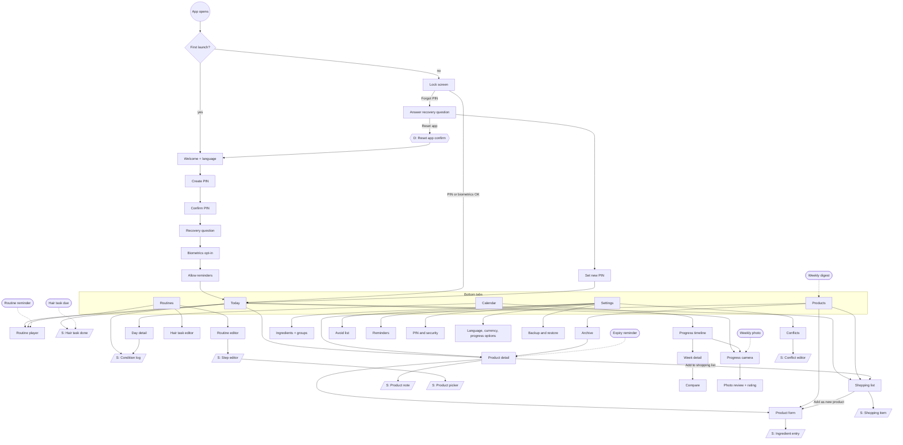
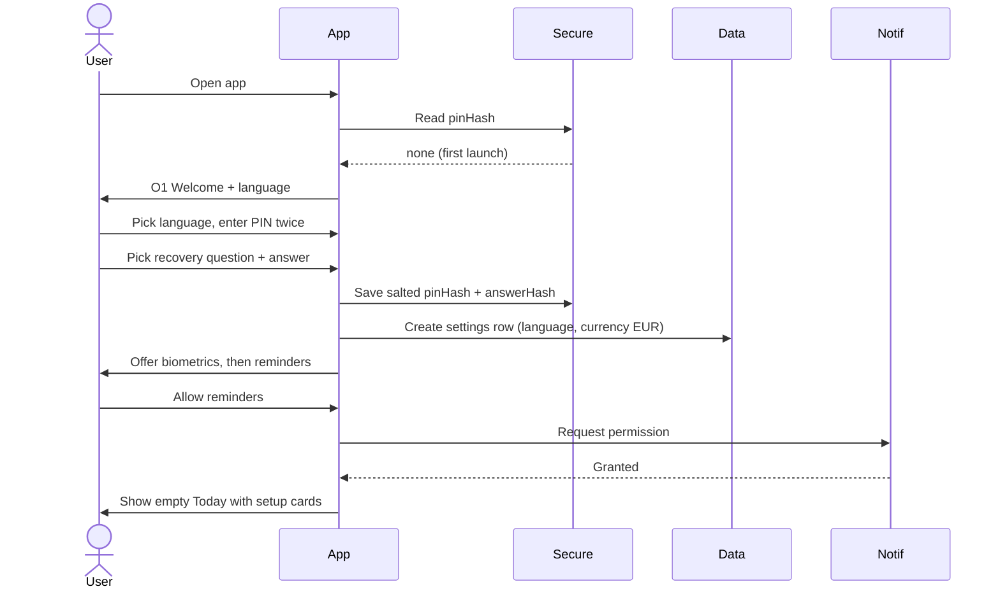
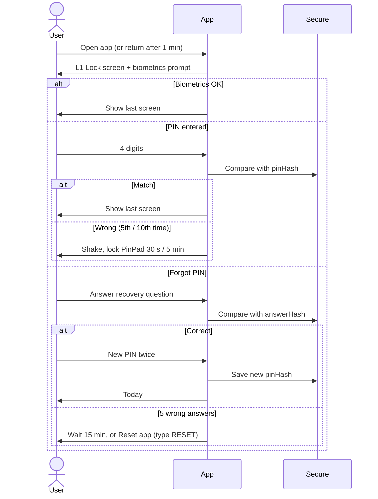
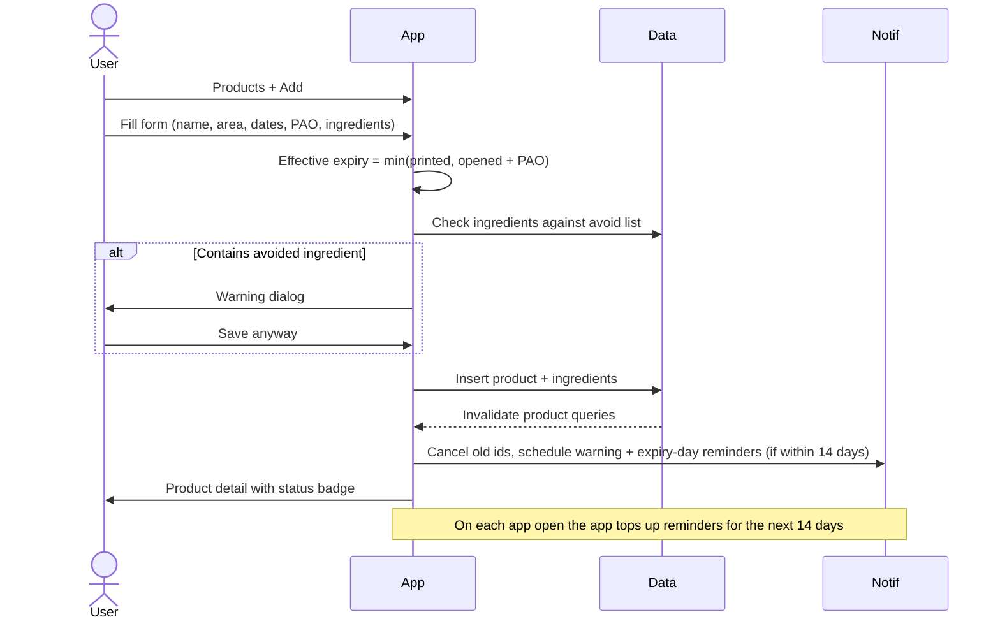
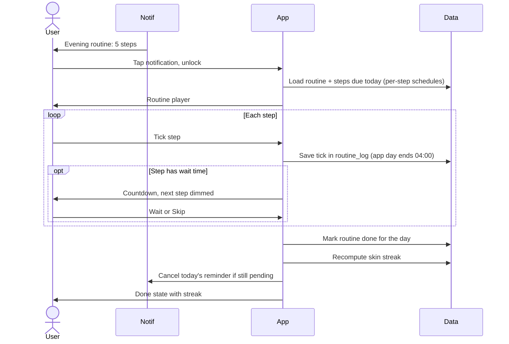
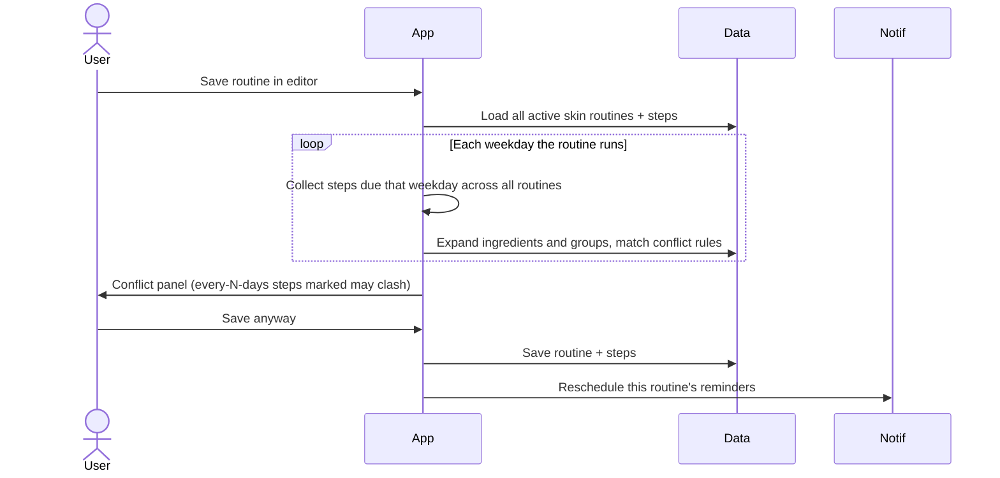
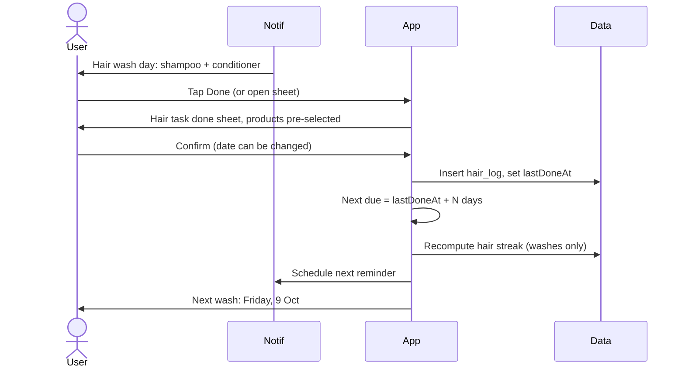
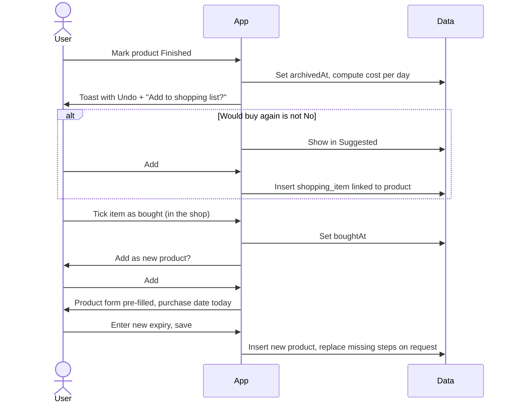
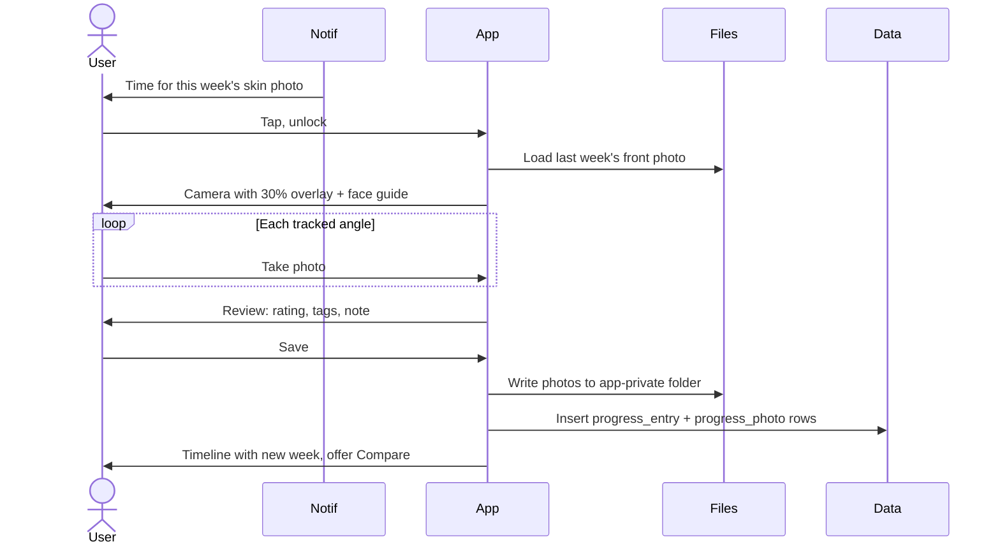
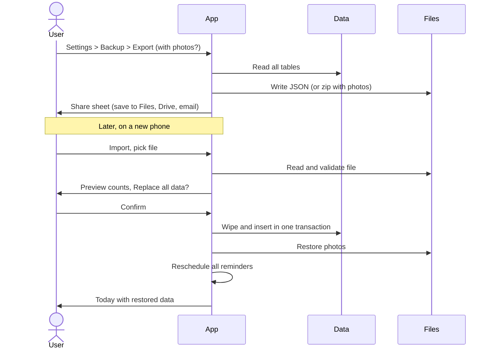

# Jx-Care Feature Spec

Written 2026-10-06. Living version: [Claude Doc](https://claude.ai/code/artifact/f898c0ac-edef-4786-bbd1-bebf1fa6c8fd).

## Overview

This spec describes every screen, state and flow in Jx-Care in enough detail to design from. It builds on the [feature plan](https://github.com/Justxs/Jx-Care/blob/main/docs/feature-plan.md); where the two differ, this spec wins. Visual style, tokens and components come from the [Jx-Care design system](https://claude.ai/artifact/6wezpPoHNSQoe9bM6GUryU).

### Refinements made in this review

| # | Area | Gap found | Refinement |
| --- | --- | --- | --- |
| 1 | Day boundary | An evening routine done at 00:30 would count for the wrong day | The app's day ends at 04:00, not midnight, for routines, streaks and logs |
| 2 | Streak + step schedules | "Every step done" was unclear once steps have their own schedule | Only steps due that day count toward done |
| 3 | Two routines in one slot | Unclear what Today shows | Today shows one card per slot with A/B chips; finishing either completes the slot |
| 4 | Expiry without dates | No rule for unopened products with no printed date | Status "No date" (grey); no reminders |
| 5 | Conflicts + step schedules | Whole-day checks could flag steps that never meet | Only steps due on the same weekday are compared; every-N-days steps show "may clash" |
| 6 | Hair schedule | No rule for washing early | Early counts as on time and resets the next due date; late shows orange |
| 7 | PIN lockout | Only one lockout step | 5 wrong tries: 30 s wait; 10: 5 min. Recovery answer: 5 wrong tries, 15 min |
| 8 | Notification permission | Never asked | Last onboarding step asks, with "Not now"; asked again the first time a reminder is switched on |
| 9 | Currency | Price had no currency | Currency set in Settings, default EUR |
| 10 | Archive vs delete | Two ways to remove a product | "Finished" archives (keeps history); "Delete" only from the archive, with confirmation |
| 11 | Missing product in a routine | A finished product left a broken step | The step shows "Missing" with "Replace" and "Add to shopping list" actions |

### Global UI rules

- **Platforms:** iOS and Android phones, portrait only. Designs at 390 × 844 (iPhone) with checks at 360 × 800 (small Android).
- **Theme:** light and dark, following the phone; Plus Jakarta Sans; pink accent; rn-primitives for every base component.
- **Language:** every string comes from LT and EN translation files. Lithuanian runs about 20–30% longer, so labels wrap to two lines instead of truncating.
- **Dates and numbers:** LT uses 2026-10-06, 24-hour time and "12,50 €"; EN follows the phone's locale.
- **Touch:** targets at least 44 × 44 pt; ticking a step gives a light haptic.
- **States:** every list screen has an empty state (illustration, one line, one action), and every form has inline validation under the field.
- **Destructive actions:** confirm in an AlertDialog (delete, reset app). Reversible ones (archive, clear bought) show a toast with Undo for 5 seconds.
- **Privacy:** photos are never written to the phone gallery; the app content is hidden in the app switcher (blur overlay) while locked.

### Styling

- **NativeWind 4.2** (Tailwind CSS 3.4 classes on React Native components), the newest stable release. NativeWind 5 (Tailwind 4) is still a release candidate; move to it once it is stable.
- Design system tokens (colours, type scale, spacing, radius, shadow) live in `tailwind.config.js` as CSS variables, with a light and a dark set, so `bg-background`, `text-foreground` and `bg-accent` switch with the phone theme.
- rn-primitives components are styled with `className`, the same setup React Native Reusables uses. No inline style objects except for animated values.
- Spacing on a 4 pt scale (`p-1` = 4 pt); screen side padding 16 pt; cards use the `rounded-xl` token.

### Motion and layout stability

Every screen should feel smooth and never jump. Animations use react-native-reanimated 4 and Expo Router's native transitions.

| Movement | Animation | Duration |
| --- | --- | --- |
| Switching bottom tabs | Cross-fade, no slide | 150 ms |
| Opening a screen (push) | Native platform transition: slide from right on iOS, fade-through on Android | System default |
| Full-screen flows (routine player, camera, compare) | Slide up; close slides down | 300 ms |
| Sheets | Slide up with backdrop fade; drag down to dismiss | Spring, about 300 ms |
| Dialogs | Fade in and scale 0.96 to 1 | 200 ms |
| Segmented switches inside a tab | Indicator slides; content cross-fades | 200 ms |
| List item added or removed | Fade plus height expand or collapse, never a hard pop | 200 ms |
| Dragging a routine step | Lifts (scale 1.03, shadow), others slide aside | Live |
| Ticking a step | Checkbox fills, light haptic | 150 ms |
| Routine finished | Card collapses to a ticked row; streak number counts up | 250 ms |
| Wrong PIN | Dots shake | 300 ms |

Easing: ease-out when things enter, ease-in when they leave. When the phone's Reduce Motion setting is on, slides and scales become short fades (100 ms) and counters show the final number at once.

No layout shift rules:

- **Skeletons, not spinners:** while data loads, each list and card shows a skeleton with the exact final size (product row 72 pt, routine card, calendar grid). Content replaces the skeleton in place with a 150 ms fade.
- **Paint Today complete:** Today's data is prefetched while the lock screen is open, so its sections are known before the first frame and none pop in afterwards.
- **Reserved image boxes:** images sit in fixed-ratio boxes with a placeholder colour before they load: product thumbnail 48 × 48, product photo 1:1, progress photos 3:4.
- **Reserved helper line:** every form field keeps a one-line slot under it for helper or error text, so a validation message never pushes the fields below.
- **Stable numbers:** countdowns, day counts and prices use tabular figures, and badges have a minimum width so "9 days" to "10 days" doesn't shift the row.
- **Fixed calendar height:** the month grid always has 6 rows, so swiping between months never changes its height.
- **Overlays stay out of the flow:** toasts, the wait timer countdown and the "Undo" bar float above the tab bar instead of being inserted between items.
- **Sections that appear later** (for example a conflict panel after a save) animate their height open instead of appearing at full size.
- **Lithuanian text:** layouts use minimum heights, not fixed ones, so longer LT labels wrap without overlapping; tab bar labels are sized for the LT words.
- **Keyboard:** forms scroll the focused field into view smoothly; the screen never jumps when the keyboard opens.

## Navigation map

Every screen sits behind the lock screen in five bottom tabs; sheets (S) slide up over the current screen and dialogs (D) are centred. Dotted lines are notification taps.

### Screen inventory

| ID | Screen | Type | Reached from |
| --- | --- | --- | --- |
| O1–O6 | Onboarding: welcome + language, create PIN, confirm PIN, recovery question, biometrics, reminders | Full screen | First launch, reset |
| L1 | Lock screen | Full screen | Every open, after 1 min away |
| L2 | Forgot PIN: recovery answer, new PIN | Full screen | Lock screen |
| T1 | Today | Tab | Home |
| T2 | Routine player | Full screen | Today, Routines, routine reminder |
| T3 | Hair task done | Sheet | Today, hair reminder |
| T4 | Condition log | Sheet | Today, Day detail |
| P1 | Products list (My products / Shopping switch) | Tab | Tab bar |
| P2 | Product detail | Screen | List, Today, expiry reminder |
| P3 | Product form (add/edit) | Screen | List, detail, shopping list |
| P4 | Ingredient entry (one per line) | Sheet | Product form |
| P5 | Archive | Screen | Products list |
| P6 | Shopping list | Tab view | Products switch, Today chip |
| P7 | Shopping item | Sheet | Shopping list |
| P8 | Product note | Sheet | Product detail |
| R1 | Routines list (Skin / Hair switch) | Tab | Tab bar |
| R2 | Routine editor | Screen | Routines list |
| R3 | Step editor | Sheet | Routine editor |
| R4 | Product picker | Sheet | Step editor, hair task editor |
| R5 | Hair task editor | Screen | Routines list (Hair) |
| C1 | Calendar (Skin / Hair / Condition views) | Tab | Tab bar |
| C2 | Day detail | Screen | Calendar |
| C3 | Progress timeline (Skin / Hair) | Tab view | Calendar switch |
| C4 | Progress camera | Full screen | Timeline, Today, weekly reminder |
| C5 | Photo review + rating | Screen | Camera |
| C6 | Week detail | Screen | Timeline |
| C7 | Compare | Full screen | Week detail, timeline |
| S1 | Settings | Tab | Tab bar |
| S2 | Ingredients + groups | Screen | Settings |
| S3 | Conflicts + editor | Screen + sheet | Settings |
| S4 | Avoid list | Screen | Settings |
| S5 | Reminders | Screen | Settings |
| S6 | PIN and security | Screen | Settings |
| S7 | Language, currency, progress options | Screen | Settings |
| S8 | Backup and restore | Screen | Settings |

## Onboarding, lock and Today

### O1–O6 Onboarding

Six short steps with a progress bar (1/6…6/6) at the top and Back on every step after the first. Nothing is saved until O4 finishes, so quitting mid-way restarts onboarding.

1. **O1 Welcome + language:** logo, app name, one-line pitch ("Track your skin and hair care in one place"), two large choices: Lietuvių / English, pre-selected from the phone language. Button: Continue.
2. **O2 Create PIN:** title "Create a 4-digit PIN", four dots, PinPad (0–9, delete). Moves on automatically after the 4th digit. Rejects 0000, 1234 and four identical digits with an inline hint.
3. **O3 Confirm PIN:** same layout, "Enter it again". Mismatch: dots shake, error "PINs don't match", back to O2.
4. **O4 Recovery question:** picker with 5 preset questions (first pet, mother's maiden name, first school, favourite teacher, birth city) plus "Write my own"; answer field (min 3 characters); helper text "You'll need this if you forget your PIN."
5. **O5 Biometrics:** shown only if the phone supports it. Icon, "Unlock with Face ID / fingerprint?", buttons: Turn on / Not now.
6. **O6 Reminders:** "Allow reminders for expiring products and routines?", buttons: Allow (system prompt) / Not now. Then lands on an empty Today.

### L1 Lock screen

- Logo, "Enter PIN", four dots, PinPad, biometrics button (if on), "Forgot PIN?" link.
- Biometrics prompt opens automatically once on arrival.
- Wrong PIN: dots shake + haptic. After 5 wrong in a row: PinPad disabled with a countdown "Try again in 30 s"; after 10: 5 minutes.
- Re-lock: after 60 s in the background (configurable 0 / 1 / 5 min). The app switcher shows a blurred overlay with the logo.

### L2 Forgot PIN

- Shows the saved question and an answer field; answer is compared ignoring case, accents and extra spaces.
- Correct: Create new PIN (O2/O3 layout), then Today.
- 5 wrong answers: wait 15 minutes. Link at the bottom: "Reset app and delete all data" opens a dialog that requires typing RESET.

### T1 Today

The home screen answers "what do I need to do today?". Sections top to bottom, each hidden when empty:

1. **Header:** greeting by time of day, date ("Tuesday, 6 October"), skin and hair streak chips (flame icon + number).
2. **Routine cards:** one card per time slot due today (Morning, Evening, custom), in time order. Card shows slot name, reminder time, step count, progress ring (3/5), and a conflict warning icon if any. Two routines in one slot: A/B chips on the card; the chosen one is remembered for that weekday. Tap: opens the routine player. Done: card collapses to a ticked row.
3. **Hair due:** rows for hair tasks due today or overdue ("Wash: shampoo + conditioner", "Overdue 1 day" in orange). Tap: Hair task done sheet.
4. **Weekly photo card:** shown on the check-in day until taken ("Time for this week's skin photo"), buttons Take photo / Skip this week.
5. **How's your skin today?:** compact chips (calm, oily, dry, breakout, redness) plus a hair row; tapping one saves at once, "Add note" opens the Condition log sheet.
6. **Expiring soon:** up to 3 product rows with days left ("12 days", red when expired) and "See all".
7. **To buy chip:** "3 to buy" linking to the shopping list.

Empty state (no products or routines yet): three setup cards: Add your first product, Create a routine, Set up hair care.

### T2 Routine player

- Full screen, opened from Today, Routines or a reminder. Header: routine name, slot, close (X), progress "Step 2 of 5".
- List of steps due today in order; skipped-today steps are hidden. Each row: product photo, name, brand, note ("2 drops"), checkbox.
- Ticking a step with a wait timer starts a countdown in a fixed bar at the bottom of the player ("Wait 1:00 before the next step") with Skip; the next step is dimmed until it ends.
- Conflict mark on a step: red dot; tap shows "Retinol conflicts with AHA in Evening B (Tue)".
- Missing product: step shows "Missing" with Replace and Add to shopping list.
- All ticked: success state with confetti-free subtle check, updated streak ("Skin streak: 12 days") and Done.
- Leaving mid-way keeps ticks for the day.

### T3 Hair task done sheet

- Title = task name, date (today, editable to yesterday or earlier), product chips pre-selected from the task (tap to unselect, + to add), note field. Button: Mark as done.
- After saving: shows the next due date ("Next wash: Friday, 9 Oct").

### T4 Condition log sheet

- Date at top (today by default). Skin chips (multi-select) and Hair chips (multi-select), each optional; note field (max 280 characters). Save.

## Products and shopping

### P1 Products list

- **Top:** segmented switch My products / Shopping (with count badge), search field, filter button, + (add) button.
- **Filters (sheet):** Area (All, Skin, Hair), Category (multi-select), Status (OK, Expiring soon, Expired, Not opened, No date), Avoid badge only. Sort: Soonest expiry (default), Name, Recently added.
- **Row (ProductRow):** photo thumbnail (or category icon), name, brand, AreaTag (Skin/Hair/Both), status Badge with days left ("Expires in 12 days" / "Expired 3 days ago" / "Not opened"), avoid badge if it contains an avoided ingredient.
- **Swipe or long-press actions:** Mark as opened (if not opened), Finished, Add to shopping list, Duplicate.
- **Footer link:** Archive (N).
- **Empty state:** "No products yet", button Add product.

Status rules: effective expiry = earlier of printed expiry and opened date + period after opening. Expiring soon = within the warning window (default 30 days). Not opened with a printed date uses that date. No dates at all = "No date" (grey).

### P2 Product detail

- Large photo (tap to view full screen), name, brand, AreaTag, category.
- **Expiry block:** status badge, progress bar from opened date to effective expiry, dates listed: purchased, opened, printed expiry, period after opening ("12M").
- **Info:** size + unit, price with currency, ingredients as chips (conflicting ones marked, avoided ones marked red), notes.
- **Used in:** routines and hair tasks that use it, each tappable.
- **My rating:** 1–5 stars and "Would buy again" Yes/No toggle.
- **Notes timeline:** dated reaction notes, newest first, + Add note.
- **Cost per day:** shown once finished ("€0.21 a day over 142 days").
- **Actions bar:** Edit, Mark as opened, Finished, Add to shopping list, more menu (Duplicate, Delete only when archived).

### P3 Product form (add / edit)

One scrolling form in groups; only Name and Area are required.

| Field | Control | Rules |
| --- | --- | --- |
| Photo | Camera / gallery picker | Optional, cropped square |
| Name | Text | Required, max 80 |
| Brand | Text with suggestions from earlier brands | Optional |
| Area | Toggle: Skin / Hair / Both | Required |
| Category | Select (cleanser, toner, serum, moisturiser, SPF, mask, exfoliant, eye care, shampoo, conditioner, hair mask, hair oil, styling, other) | Default other |
| Size + unit | Number + select (ml, g, pcs) | Optional |
| Price | Number with currency suffix | Optional, ≥ 0 |
| Purchase date | Date picker | Default today |
| Printed expiry date | Date picker | Optional |
| Opened | Toggle; reveals Opened date | Date ≤ today |
| Period after opening | Chips 3M, 6M, 9M, 12M, 18M, 24M, 36M + custom | Optional |
| Ingredients | Multi-line field, one ingredient per line (P4) | Optional |
| Notes | Multi-line text | Max 500 |

Live preview at the bottom: "Expires on 2027-04-06 (in 182 days)". Saving a product with an avoided ingredient shows a warning dialog (Save anyway / Edit ingredients).

### P4 Ingredient entry

Ingredients are entered one per line in a multi-line field, not separated by commas: each line is one ingredient and Enter starts the next. While typing a line, matching ingredients from the user's list are suggested above the keyboard; tapping one fills the line. Pasting a list with one ingredient per line works the same way. Blank lines are ignored, extra spaces are trimmed and duplicates are merged. Below the field, a live preview shows the parsed ingredients as chips: chips in a conflict show a small link icon, avoided ones show red, and ones not yet in the user's list show a "New" tag. Done saves the list and adds new ingredients to the user's list.

### P5 Archive

Finished products, newest first, with finished date and cost per day. Sort by date or cost per day. Actions: Restore, Add to shopping list, Delete (confirm).

### P6 Shopping list

- **Suggested** (top, collapsible): finished or expiring products not yet on the list, each with + and dismiss. Products marked "Would buy again: No" never appear.
- **To buy:** checkbox rows: name, brand, AreaTag, last price and size for linked items, note. Filter chips: All, Skin, Hair.
- **Want to try:** separate section for ideas, same rows; "Move to To buy".
- **Bought:** ticked items, cleared after 30 days; Clear bought button.
- Top bar: + Add item, Share (plain text list).
- Ticking a linked item opens a prompt: "Add as new product?" with Add / Not now. Add opens the product form pre-filled (name, brand, category, area, size, unit, ingredients, purchase date today).

### P7 Shopping item sheet

Toggle Buy again (pick product) / New item. New item fields: name (required), brand, area, list (To buy / Want to try), note.

### P8 Product note sheet

Date (default today), text (required, max 280), quick tags (breakout, irritation, calm, glow). Save.

## Routines and hair tasks

### R1 Routines list

- Segmented switch: Skin / Hair.
- **Skin:** routines grouped by slot (Morning, Evening, custom). Card: name, weekday dots (M T W T F S S, active ones filled), reminder time, step count, conflict icon, active switch. Tap: editor. Play button: routine player. + New routine. Long-press: Duplicate as variant, Delete.
- **Hair:** two groups, Washes and Events. Row: name, frequency ("Every 3 days", "Every 8 weeks", "Mon, Thu"), next due date, last done ("Last trim 7 weeks ago"). + New hair task.
- Empty states: "No routines yet: build your morning routine" / "Set how often you wash your hair".

### R2 Routine editor

| Field | Control | Rules |
| --- | --- | --- |
| Name | Text | Required, e.g. "Evening A: retinol" |
| Slot | Chips: Morning / Evening / Custom (name + default time) | Required |
| Days | Seven weekday toggles + "Every day" shortcut | At least one day |
| Reminder | Switch + time picker | Optional |
| Steps | Reorderable list (drag handle) | At least one step to save |

- Step row (RoutineStep): order number, product photo + name, schedule chip if not every time ("Tue, Fri" / "Every 3 days"), wait chip ("1 min"), conflict dot. Tap: step editor. Swipe: delete.
- **Conflict panel** at the bottom, when any: "2 conflicts this week", each line "Retinol (step 3) × Glycolic acid in Evening B, Tue" with "may clash" label for every-N-days steps. Saving is still allowed.
- Unsaved changes: leaving asks Discard / Keep editing.

### R3 Step editor sheet

- Product (opens product picker; only Skin or Both products), note ("2 drops"), schedule: Every time (default) / Only on (weekday toggles limited to the routine's days) / Every N days (number + start date), wait after step: none, 30 s, 1, 2, 5, 10, 15, 20 min.

### R4 Product picker sheet

Search, filters by category, rows with status badge; expired products are shown but marked; + Add new product opens the product form and returns with it selected.

### R5 Hair task editor

| Field | Control | Rules |
| --- | --- | --- |
| Type | Toggle: Wash / Event | Required |
| Name | Text | e.g. "Wash", "Hair mask", "Trim" |
| Products | Product picker, multi (Hair or Both) | Wash only |
| Frequency | Every N days / On weekdays / Every N weeks (events) | Required |
| Last done | Date | Default today; sets the first due date |
| Reminder | Switch + time | Optional |

Preview line: "Next due: Friday, 9 Oct". Washes count toward the hair streak; events don't.

## Calendar, progress and condition

### C1 Calendar

- Segmented switch: Skin / Hair / Condition / Progress (Progress opens C3).
- **Skin view:** month grid; each day a coloured dot: done (accent), partly done (half), missed (grey ring), nothing scheduled (none); today outlined. Above: streak card with current and best.
- **Hair view:** wash days done (filled), due (outlined), overdue (orange), events as small icons (scissors, palette). Hair streak card.
- **Condition view:** each day shows the logged skin state as a small coloured chip (calm green, oily yellow, dry blue, breakout red, redness pink); legend below.
- Swipe left/right between months; "Today" button returns.

### C2 Day detail

- Date title, skin routines (done/partly/missed with each step ticked or not), hair tasks done, condition log (or "Log how your skin was"), product notes written that day, progress photo thumbnail if that week's check-in was that day.
- Past days are editable up to 7 days back (tick a forgotten step); older days are read-only.

### C3 Progress timeline

- Switch Skin / Hair (Hair only when the hair album is on).
- Grid of weekly check-ins, newest first: front photo thumbnail, week label ("Week 41 · 6 Oct"), rating stars. Missing weeks shown as empty tiles "No photo".
- Top: Take this week's photo (if not taken), Compare button.
- Empty state: example illustration, "Take a photo each week to see your skin change", Take first photo.

### C4 Progress camera

- Full-screen front camera. Overlay: last week's photo at 30% opacity (toggle on/off), face oval guide, angle label ("Front", then "Left side", "Right side" for tracked angles), flash off, tips row "Same light · no makeup · hair back".
- Shutter, retake, switch camera. After each angle: next angle; after the last: review.

### C5 Photo review + rating

Photos of all angles, rating 1–5, tags (breakout, redness, dryness, oiliness, calm), note. Save. Saving shows "Saved privately in Jx-Care".

### C6 Week detail

All angles full width (swipe), rating, tags, note, "What changed this week": routines done (5 of 7 evenings), products started or stopped, condition log summary. Actions: Compare with…, Retake, Delete photo / week.

### C7 Compare

Two modes: side by side (two columns, week labels on top) and slider (one image, drag a vertical handle). Week pickers for left and right; quick chip "4 weeks ago vs now". Angle switcher. Pinch to zoom both in sync.

## Settings

### S1 Settings list

Grouped rows with chevrons: **Care data** (Ingredients, Conflicts, Avoid list), **Reminders**, **Security** (PIN and security), **Preferences** (Language, Currency, Progress photos), **Data** (Backup and restore, Reset app), **About** (version, licences).

### S2 Ingredients + groups

- Tabs: Ingredients / Groups. Ingredient row: name, group chip, "in 4 products". Tap: rename, set group, see products. Merge duplicates ("Niacinamide" + "niacinamide") via select mode.
- Group row: name, member count; editor lists members with add/remove.

### S3 Conflicts + editor

- List of rules: "Retinol × AHA" (either side can be an ingredient or a group, shown with a group icon), note, number of affected routines.
- Editor sheet: left side picker, right side picker, note. Saving re-checks all routines and shows "Affects 2 routines".

### S4 Avoid list

Rows: ingredient or group, note ("allergic"), "in 1 product" warning count. + Add. Products containing an avoided item show a red avoid badge everywhere.

### S5 Reminders

| Reminder | Default | Options |
| --- | --- | --- |
| Expiry warning | 30 days before, at 09:00 | 7 / 14 / 30 / 60 days; time |
| Expiry day | On, 09:00 | On/off |
| Routine reminders | Per routine | Set in each routine; master switch here |
| Hair tasks | Per task | Set in each task; master switch here |
| Weekly photo | Sunday 10:00 | Weekday, time, on/off |
| Weekly digest | Monday 09:00 | On/off |
| Snooze length | 15 min | 5 / 15 / 30 min |

If system permission is off, a banner at the top: "Notifications are off for Jx-Care" with Open settings.

### S6 PIN and security

Change PIN (old PIN, new, confirm), change recovery question (needs PIN), biometrics switch, auto-lock after (Immediately / 1 min / 5 min).

### S7 Preferences

Language (Lietuvių / English, applies at once), currency (EUR default, then USD, GBP, PLN, others), progress photos: tracked skin angles, hair album on/off, hair angles, overlay opacity.

### S8 Backup and restore

- Export: JSON file (all data except photos) or zip with photos; shared through the phone's share sheet. Shows last backup date and a reminder if older than 30 days.
- Import: pick a file, preview counts ("84 products, 6 routines, 52 photos"), then Replace all data (confirm dialog). Import never merges, to keep it predictable.
- Reset app: dialog requiring PIN, then typing RESET.

## Notifications

All notifications are local, scheduled on the phone, and open the app behind the lock screen first (PIN, then the target screen). Text is shown in the app's language.

| Notification | When | Example text (EN) | Opens | Actions |
| --- | --- | --- | --- | --- |
| Expiry warning | Warning date, 09:00 | "Vitamin C serum expires in 30 days" | Product detail | Add to shopping list |
| Expiry day | Effective expiry date, 09:00 | "Vitamin C serum expires today" | Product detail | Finished |
| Routine reminder | Routine time on its days, skipped if already done | "Evening routine: 5 steps" | Routine player | Snooze |
| Hair task due | Due date, chosen time | "Hair wash day: shampoo + conditioner" | Hair task done sheet | Done, Snooze |
| Hair event due | Due date | "Time for a trim (8 weeks)" | Hair task done sheet | Done |
| Weekly photo | Chosen weekday and time, once | "Time for this week's skin photo" | Progress camera | Skip this week |
| Weekly digest | Monday 09:00 | "2 expiring soon, 1 expired, 3 unopened" | Products list, filtered | None |
| Backup reminder | 30 days after last backup, once a month | "Back up your Jx-Care data" | Backup and restore | None |

Scheduling rule: iOS allows 64 pending notifications, so the app keeps only the next 14 days scheduled and tops up every time it opens and at the daily background refresh.

## Sequence diagrams

Nine flows, using these parts: **App** (screens), **Data** (TanStack Query over SQLite via Drizzle), **Secure** (expo-secure-store), **Notif** (expo-notifications, the phone's scheduler) and **Files** (app-private storage).

### 1. First launch and PIN setup

### 2. Unlock, auto-lock and forgotten PIN

### 3. Add a product and schedule expiry reminders

### 4. Doing a routine

### 5. Saving a routine: conflict check

### 6. Hair wash cycle

### 7. Finished product to shopping list and back

### 8. Weekly progress photo

### 9. Backup and restore

