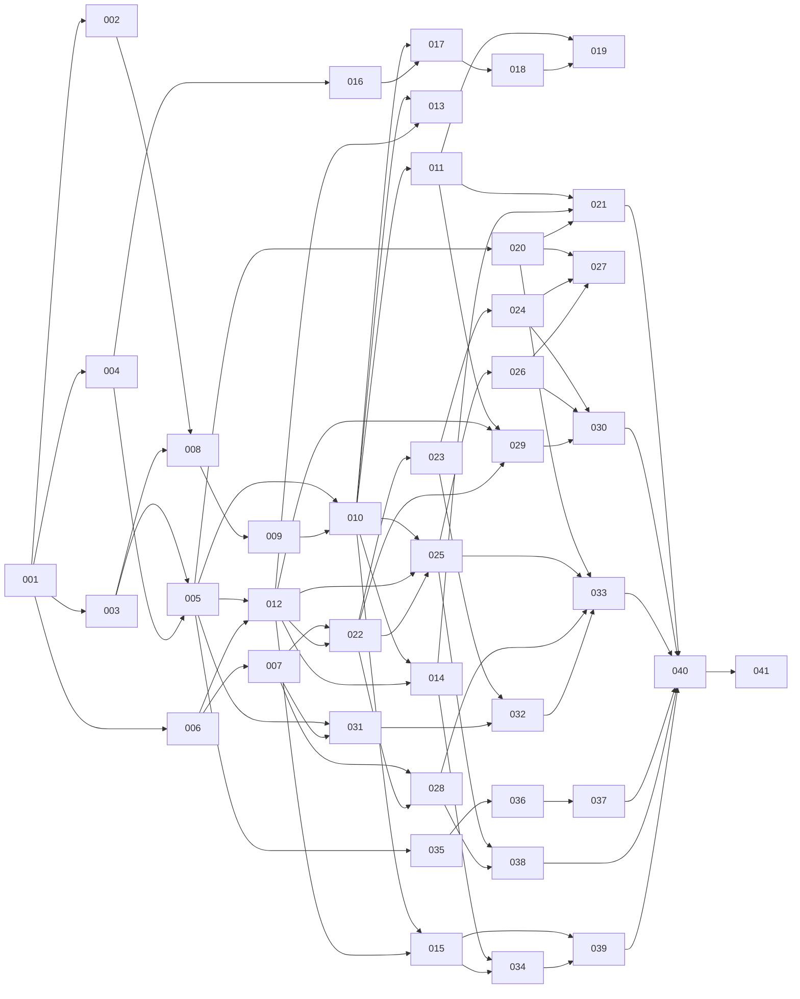

# Jx-Care build tasks

The app broken into 41 tasks that a coding agent can pick up one at a time. Each task file says what to build, which spec sections and design cards it covers, what is out of scope, how to test it and when it is done.

**Before starting any task, read [conventions.md](conventions.md).** It holds the stack, the folder layout, the code and UI rules and the definition of done that every task assumes.

## How to pick a task

1. Take the lowest-numbered task whose status is **todo** and whose "Depends on" tasks are all **done**.
2. Set it to **in progress** in the table below, commit that one line to `main` and push, so nobody else takes it.
3. Build it, meet the definition of done in conventions.md, set it to **done** and push.

Tasks in the same phase with no dependency between them can run in parallel (for example 006 next to 002–005, or 031 next to 022–028).

## Phases

| Phase | Tasks | Ends with |
| --- | --- | --- |
| A. Foundation | 001–007 | An empty app that builds, with theme, translations, database and all core rules tested |
| B. UI kit and shell | 008–011 | Five tabs with placeholder screens, every base component, Settings with language switch |
| C. Products | 012–015 | Products can be added, listed, filtered, viewed, finished and restored |
| D. Security | 016–019 | Onboarding, PIN lock, forgot PIN, security settings |
| E. Expiry reminders | 020–021 | Local notifications for expiry, the reminder ask and the Reminders screen |
| F. Routines and Today | 022–027 | Skin routines, Today, the routine player and routine reminders |
| G. Calendar | 028 | Skin calendar, streaks and day detail |
| H. Conflicts | 029–030 | Ingredient groups, conflict rules, avoid list and warnings everywhere |
| I. Hair | 031–033 | Hair tasks, quick setup, hair done, hair calendar and reminders |
| J. Shopping | 034 | Shopping list with Buy again and suggestions |
| K. Progress photos | 035–037 | Weekly photos, camera with guide, Progress photos screen and compare |
| L. Condition and notes | 038–039 | Daily condition log, product notes and ratings |
| M. Finish | 040–041 | Backup and restore, final quality pass and release builds |

PIN lock comes after products on purpose (as in the feature plan): the data screens are easier to test without a lock, and the lock then wraps the finished navigation.

## Task list

Status: **todo**, **in progress**, **done**. Task files 008 onward follow the final designs (design system v17).

| # | Task | Depends on | Spec | Status |
| --- | --- | --- | --- | --- |
| 001 | [Project scaffold](001-project-scaffold.md) | none | Global UI rules | done |
| 002 | [Theme, fonts and motion](002-theme-fonts-motion.md) | 001 | Styling, Motion | done |
| 003 | [Translations and formatting](003-i18n-formatting.md) | 001 | Global UI rules, Words and copy | done |
| 004 | [Database schema and migrations](004-database.md) | 001 | Data model | done |
| 005 | [Data access and app state](005-data-access-app-state.md) | 003, 004 | Sequence diagrams (Data) | done |
| 006 | [Logic: app day, expiry, cost, ingredients](006-logic-dates-expiry.md) | 001 | Refinements 1, 4; P1, P4 | done |
| 007 | [Logic: schedules, streaks, hair, conflicts](007-logic-schedules-streaks-conflicts.md) | 006 | Refinements 2, 3, 5, 6; R3, R5, C1 | done |
| 008 | [Base components](008-base-components.md) | 002, 003 | DESIGN.md Components | done |
| 009 | [Forms, sheets, dialogs and toasts](009-forms-overlays-feedback.md) | 008 | Global UI rules, Motion | done |
| 010 | [App shell and navigation](010-app-shell-navigation.md) | 005, 009 | Navigation map | done |
| 011 | [Settings list and preferences](011-settings-preferences.md) | 010 | S1, S7 | done |
| 012 | [Products data](012-products-data.md) | 005, 006 | P1–P5 | done |
| 013 | [Products list](013-products-list.md) | 010, 012 | P1 | done |
| 014 | [Product form and ingredient entry](014-product-form-ingredients.md) | 010, 012 | P3, P4 | done |
| 015 | [Product detail and archive](015-product-detail-archive.md) | 010, 012 | P2, P5 | done |
| 016 | [PIN and secure storage service](016-pin-secure-storage.md) | 004 | O2–O4, L1, L2 rules | done |
| 017 | [Onboarding](017-onboarding.md) | 010, 016 | O1–O5 | done |
| 018 | [Lock screen and forgot PIN](018-lock-forgot-pin.md) | 017 | L1, L2 | todo |
| 019 | [PIN and security settings](019-security-settings.md) | 011, 018 | S6 | todo |
| 020 | [Notification service](020-notification-service.md) | 005 | Notifications | done |
| 021 | [Expiry reminders and the Reminders screen](021-expiry-reminders.md) | 011, 014, 020 | P3 reminder ask, S5 | done |
| 022 | [Routines data](022-routines-data.md) | 007, 012 | R1–R3, T2 | done |
| 023 | [Routines list and templates](023-routines-list-templates.md) | 010, 022 | R1 skin, R2 starter | done |
| 024 | [Routine editor, step editor, product picker](024-routine-editor.md) | 023 | R2, R3, R4 | done |
| 025 | [Today](025-today.md) | 010, 012, 022 | T1 | done |
| 026 | [Routine player](026-routine-player.md) | 022, 025 | T2 | done |
| 027 | [Routine reminders](027-routine-reminders.md) | 020, 024, 026 | Notifications, sequence 4 | todo |
| 028 | [Skin calendar and day detail](028-skin-calendar-day-detail.md) | 007, 022, 010 | C1 skin, C2 | done |
| 029 | [Ingredients, groups and conflict rules](029-ingredients-conflict-rules.md) | 011, 012, 022 | S2, S3 | done |
| 030 | [Conflict warnings and avoid list](030-conflict-warnings-avoid-list.md) | 024, 026, 029 | S4, R2 panel, T2, P1–P3 | todo |
| 031 | [Hair data](031-hair-data.md) | 005, 007 | R5, T3 | done |
| 032 | [Hair setup and hair task editor](032-hair-setup-editor.md) | 023, 031 | R1 hair, R5 | done |
| 033 | [Hair done, hair calendar and hair reminders](033-hair-done-calendar-reminders.md) | 020, 025, 028, 032 | T3, C1 hair | done |
| 034 | [Shopping list](034-shopping-list.md) | 014, 015 | P6, P7, sequence 7 | done |
| 035 | [Progress photo data and storage](035-progress-data-storage.md) | 005 | C3–C7 data | done |
| 036 | [Progress camera and review](036-progress-camera-review.md) | 020, 025, 035 | C4, C5, T1 check-in photo row | todo |
| 037 | [Progress photos, week detail and compare](037-progress-timeline-compare.md) | 036 | C3, C6, C7, S7 photos | todo |
| 038 | [Condition log](038-condition-log.md) | 025, 028 | T4, C1 condition, C2 | done |
| 039 | [Product notes and rating](039-product-notes-rating.md) | 015, 034 | P2 rating, P8 | done |
| 040 | [Backup and restore](040-backup-restore.md) | 021, 030, 033, 037, 038, 039 | S8, sequence 9 | todo |
| 041 | [Final quality pass and release builds](041-final-quality-release.md) | all | Global UI rules | todo |

## Dependency graph

## Decisions this plan makes

Choices the spec left open, made here so every task agrees. Change them here if Justas decides otherwise.

| Topic | Decision |
| --- | --- |
| Storage of dates | Calendar days are `'YYYY-MM-DD'` app days (day ends 04:00); moments are epoch ms |
| Weekdays | ISO 1 = Monday … 7 = Sunday; weeks start on Monday |
| Money | Integer cents plus the currency code from settings |
| PIN and recovery answer | Salted SHA-256 hashes in expo-secure-store, with the lockout counters, so a restart doesn't reset a lockout |
| Calendar day colours | Done = every time of day due that day is complete; partly done = something ticked but not all; missed = nothing ticked (shown to people as "Not done", never "Missed"; `missed` stays the internal value); none = nothing due |
| Skin streak | A day extends the streak when at least one routine due that day is complete (feature plan rule); a day with nothing due is skipped; today only counts once complete and never breaks the streak while it is still today |
| History before a routine existed | Days before a routine's creation date never count as missed ("Not done") |
| Hair "twice a week" in quick setup | Set days Monday and Thursday |
| Hair "every few weeks" | Stored as a number of days with a weeks unit for display |
| Tests for repositories | Run in Node on better-sqlite3 with the same Drizzle schema and migrations |
